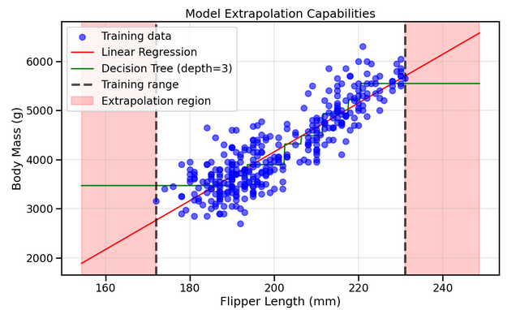

# Rapport Complet : Cours Machine Learning avec Scikit-learn

## Vue d'Ensemble du MOOC

Ce rapport synthétise l'intégralité du cours Machine Learning organisé en 7 modules progressifs, couvrant les concepts fondamentaux jusqu'aux techniques avancées d'évaluation et d'optimisation. Le cours adopte une approche pratique avec scikit-learn, combinant théorie solide et implémentation concrète.

---

## Table des Matières

1. [Module 1 : Fondements du Machine Learning](#module-1--fondements-du-machine-learning)
2. [Module 2 : Overfitting, Underfitting et Validation](#module-2--overfitting-underfitting-et-validation)
3. [Module 3 : Optimisation des Hyperparamètres](#module-3--optimisation-des-hyperparamètres)
4. [Module 4 : Modèles Linéaires Avancés](#module-4--modèles-linéaires-avancés)
5. [Module 5 : Arbres de Décision](#module-5--arbres-de-décision)
6. [Module 6 : Méthodes d'Ensemble](#module-6--méthodes-densemble)
7. [Module 7 : Stratégies de Validation et Métriques](#module-7--stratégies-de-validation-et-métriques)
8. [Synthèse et Progression Pédagogique](#synthèse-et-progression-pédagogique)
9. [Ressources et Visualisations](#ressources-et-visualisations)
10. [Recommandations Pratiques](#recommandations-pratiques)

---

## Module 1 : Fondements du Machine Learning

### Concepts Clés Introduits

Le premier module établit les **fondations conceptuelles** du machine learning :

- **Définition du ML** : Apprentissage automatique permettant aux ordinateurs d'apprendre à partir de données
- **Vocabulaire fondamental** : Features, target, dataset avec analogies programming-friendly
- **Types de problèmes** : Classification (catégories) vs Régression (valeurs continues)

### Exploration et Préparation des Données

#### Méthodologie d'Exploration
```python
# Workflow d'exploration type
penguins.head()        # Inspection visuelle
penguins.info()        # Types et valeurs manquantes
penguins.describe()    # Statistiques descriptives
penguins["Species"].value_counts()  # Distribution des classes
```

#### Preprocessing Essentiel
- **StandardScaler** : Normalisation des features numériques (moyenne=0, écart-type=1)
- **Train-Test Split** : Séparation des données pour éviter l'overfitting
- **Pipeline** : Enchaînement automatisé preprocessing + modèle


### Premier Algorithme : K-Nearest Neighbors

Le KNN sert d'**algorithme pédagogique** idéal :
- **Intuition simple** : Classification par vote des k plus proches voisins
- **API scikit-learn** : Introduction au pattern fit/predict/score
- **Hyperparamètre n_neighbors** : Premier exemple d'optimisation

### Gestion des Données Mixtes

#### Types de Données et Encodage
- **Ordinal Encoding** : Attribution d'entiers (problème d'ordre artificiel)
- **One-Hot Encoding** : Colonnes binaires (pas d'ordre, plus sûr)
- **ColumnTransformer** : Application de transformations différentes par type de colonne


#### Stratégies par Algorithme
- **Modèles linéaires** : One-Hot + StandardScaler obligatoires
- **Arbres** : Ordinal Encoding + pas de normalisation

### Introduction à la Validation Croisée


Concept critique pour l'**évaluation robuste** :
- **Problème du simple split** : Résultats biaisés selon la division
- **K-Fold CV** : Répétition avec différents folds pour estimation moyenne
- **Avantages** : Utilise toutes les données, mesure l'incertitude

---

## Module 2 : Overfitting, Underfitting et Validation

### Diagnostic des Modèles

#### Analyse des Erreurs Train vs Test
Le module introduit une méthodologie rigoureuse pour **diagnostiquer le comportement des modèles** :

```python
cv_results = cross_validate(
    regressor, data, target,
    return_train_score=True,  # Clé pour le diagnostic
    cv=ShuffleSplit(n_splits=30)
)
```

#### Interprétation des Patterns
- **Sous-apprentissage** : Erreurs train et test toutes deux élevées
- **Sur-apprentissage** : Erreur train faible, erreur test élevée
- **Équilibre optimal** : Erreurs train et test similaires et faibles

### Courbes de Validation


Les courbes de validation permettent d'**optimiser les hyperparamètres visuellement** :

```python
ValidationCurveDisplay.from_estimator(
    regressor, data, target,
    param_name="max_depth",
    param_range=np.array([1, 5, 10, 15, 20, 25])
)
```

#### Zones d'Interprétation
1. **Zone de sous-apprentissage** : Hyperparamètre trop contraignant
2. **Zone optimale** : Équilibre entre complexité et généralisation
3. **Zone de sur-apprentissage** : Hyperparamètre trop permissif

### Courbes d'Apprentissage


Outil d'analyse de l'**impact de la taille des données** :
- **Erreur d'entraînement** : Augmente avec plus de données (plus difficile de mémoriser)
- **Erreur de test** : Diminue avec plus de données (meilleure généralisation)
- **Plateau** : Indication que plus de données ne sera pas utile

### Concepts Avancés

#### Sources de Bruit
- **Imprécision de mesure** : Capteurs physiques
- **Erreurs humaines** : Saisie de données
- **Features manquantes** : Informations pertinentes non capturées

#### Applications Pratiques
Le module utilise des **exemples concrets** (prix immobilier, classification sanguine) pour illustrer ces concepts sur des cas réels.

---

## Module 3 : Optimisation des Hyperparamètres

### Fondements de l'Optimisation

#### Définition des Hyperparamètres
Les hyperparamètres sont des **paramètres de contrôle** qui :
- Sont spécifiés par l'utilisateur avant l'entraînement
- Impactent directement les performances de généralisation
- Ne peuvent pas être estimés directement à partir des données

#### API de Manipulation
```python
# Inspection des hyperparamètres
model.get_params()

# Modification dynamique
model.set_params(classifier__C=0.1)
```

### Stratégies de Recherche

#### Grid Search Exhaustive
```python
param_grid = {
    "classifier__learning_rate": (0.01, 0.1, 1, 10),
    "classifier__max_leaf_nodes": (3, 10, 30)
}

grid_search = GridSearchCV(model, param_grid, cv=5)
```

**Avantages** : Exhaustif, reproductible
**Inconvénients** : Coût exponentiel avec le nombre d'hyperparamètres

#### Random Search Adaptatif


```python
param_distributions = {
    "classifier__l2_regularization": loguniform(1e-6, 1e3),
    "classifier__learning_rate": loguniform(0.001, 10)
}

random_search = RandomizedSearchCV(
    model, param_distributions, 
    n_iter=50  # Budget fixe
)
```

**Avantages** : Budget contrôlé, distributions continues
**Recommandation** : Utilisé quand ≥ 3 hyperparamètres

### Validation Sans Biais

#### Problème du Data Leakage
Utiliser les mêmes données pour optimisation ET évaluation crée un **biais optimiste**.

#### Solution : Validation Croisée Imbriquée


```python
# Configuration imbriquée
inner_cv = KFold(n_splits=5)  # Optimisation hyperparamètres
outer_cv = KFold(n_splits=3)  # Évaluation du processus complet

nested_scores = cross_val_score(grid_search, X, y, cv=outer_cv)
```

Cette approche fournit une **estimation non biaisée** des performances réelles.

### Méthodologie Pratique

#### Workflow Recommandé
1. **Exploration manuelle** : Comprendre l'impact des hyperparamètres
2. **Grid search grossier** : Identifier les bonnes régions  
3. **Affinage local** : Optimiser finement autour des zones prometteuses
4. **Évaluation finale** : Sur un test set indépendant

---

## Module 4 : Modèles Linéaires Avancés

### Régression Linéaire Fondamentale

#### De l'Implémentation Manuelle à Scikit-learn
Le module débute par une **implémentation pédagogique** pour comprendre les mécanismes :

```python
# Calcul manuel des coefficients
def fit_linear_regression(x, y):
    a = np.sum((x - x.mean()) * (y - y.mean())) / np.sum((x - x.mean()) ** 2)
    b = y.mean() - a * x.mean()
    return a, b
```

Transition vers l'**API standardisée** :
```python
model = LinearRegression()
model.fit(X_train, y_train)
```

### Classification avec Régression Logistique

#### Mécanisme de la Fonction Sigmoïde
- **Transformation** : Scores linéaires → Probabilités [0,1]
- **Seuillage** : Probabilité > 0.5 → Classe positive
- **Frontières linéaires** : Séparation par hyperplans


#### Applications Pratiques
Utilisation du **dataset des pingouins** pour illustrer la classification binaire et multiclasse.

### Ingénierie de Caractéristiques Non-linéaires

#### Transformations Polynomiales
```python
poly_features = PolynomialFeatures(degree=2, include_bias=False)
X_poly = poly_features.fit_transform(X)
```

Cette technique permet aux modèles linéaires de **capturer des relations non-linéaires**.


#### Avantages et Limitations
- **Flexibilité accrue** : Modélisation de courbes complexes
- **Risque d'overfitting** : Nécessite régularisation appropriée
- **Explosion dimensionnelle** : Nombre de features croît rapidement

### Techniques de Régularisation

#### Ridge Regression
```python
ridge_cv = RidgeCV(alphas=np.logspace(-6, 6, 13))
ridge_cv.fit(X_train, y_train)
```

**Principe** : Pénalisation L2 des coefficients pour réduire la complexité
**Paramètre alpha** : Contrôle l'intensité de la régularisation


#### Impact de la Mise à l'Échelle
La régularisation est **sensible à l'échelle des features** :
- StandardScaler : Standardisation recommandée
- MinMaxScaler : Alternative pour données bornées

### Approximation de Noyaux

#### Méthode de Nyström
```python
nystroem = Nystroem(kernel='rbf', gamma=0.1, n_components=100)
X_nystroem = nystroem.fit_transform(X)
```


**Avantage** : Combine flexibilité des noyaux et efficacité des modèles linéaires
**Applications** : Alternative aux SVM pour grands datasets

---

## Module 5 : Arbres de Décision

### Principes Fondamentaux

#### Mécanisme de Partitionnement
Les arbres créent des **partitions rectangulaires** de l'espace des features :
- Un split par nœud sur une seule feature
- Critères d'arrêt : profondeur, nombre d'échantillons, pureté
- Prédiction : Valeur majoritaire (classification) ou moyenne (régression)


#### Différences avec Modèles Linéaires
- **Frontières** : Rectangulaires vs obliques
- **Suppositions** : Aucune vs linéarité
- **Interprétabilité** : Structure arborescente vs coefficients

### Classification et Régression

#### API Unifiée
```python
# Classification
tree_clf = DecisionTreeClassifier(max_depth=3, random_state=0)

# Régression  
tree_reg = DecisionTreeRegressor(max_depth=3, random_state=0)
```

#### Visualisation de la Structure
```python
from sklearn.tree import plot_tree
plot_tree(tree_clf, feature_names=features, class_names=classes, filled=True)
```


### Limitations et Capacités

#### Problème d'Extrapolation
**Limitation critique** : Les arbres ne peuvent pas extrapoler au-delà de leur domaine d'entraînement.



- **Modèles linéaires** : Continuent la tendance
- **Arbres** : Prédictions constantes hors domaine

#### Implications Pratiques
- Enrichir les données d'entraînement pour couvrir le domaine de prédiction
- Considérer des modèles linéaires si extrapolation nécessaire
- Utiliser des ensembles pour améliorer l'extrapolation

### Optimisation des Hyperparamètres

#### Hyperparamètres Critiques
- **max_depth** : Contrôle global de la complexité
- **min_samples_leaf** : Régularisation fine, permet asymétrie
- **max_leaf_nodes** : Alternative à max_depth
- **min_impurity_decrease** : Seuil de qualité des splits

#### Stratégies d'Optimisation
```python
param_grid = {
    'max_depth': [3, 5, 7, 10],
    'min_samples_leaf': [1, 5, 10],
    'min_samples_split': [2, 5, 10]
}
```

### Bonnes Pratiques

#### Preprocessing Adapté
- **Pas de normalisation** nécessaire
- **Ordinal encoding** suffisant pour catégories
- **Robustesse aux outliers** naturelle

#### Amélioration des Performances
Transition naturelle vers les **méthodes d'ensemble** :
- Random Forest : Parallélisation d'arbres
- Gradient Boosting : Séquentialisation corrective

---

## Module 6 : Méthodes d'Ensemble

### Philosophie des Ensembles

#### Principe Fondamental
**"Plusieurs modèles simples surpassent un modèle complexe"** quand combinés intelligemment.

#### Types d'Approches
- **Bagging** : Entraînement parallèle sur échantillons différents
- **Boosting** : Entraînement séquentiel avec correction des erreurs

### Random Forest : Bagging d'Arbres

#### Mécanisme Triple
1. **Bootstrap sampling** : Échantillons avec remise
2. **Sélection aléatoire features** : Sous-ensemble à chaque split  
3. **Agrégation** : Vote majoritaire ou moyenne

```python
rf_clf = RandomForestClassifier(
    n_estimators=100,    # Nombre d'arbres
    max_features='sqrt', # Features par split
    max_depth=None       # Profondeur libre
)
```


#### Avantages Distinctifs
- **Très résistant à l'overfitting** : Moyennage des erreurs
- **Parallélisable** : Entraînement rapide
- **Peu sensible aux hyperparamètres** : Paramètres par défaut souvent bons
- **Importance des features** : Analyse automatique des contributions

### Gradient Boosting : Correction Séquentielle

#### Processus Itératif
1. **Initialisation** : Prédiction simple (moyenne/classe majoritaire)
2. **Correction séquentielle** : Chaque modèle corrige les erreurs précédentes
3. **Combinaison pondérée** : Learning rate contrôle la contribution

```python
gb_clf = GradientBoostingClassifier(
    n_estimators=100,     # Nombre d'étapes
    learning_rate=0.1,    # Vitesse d'apprentissage
    max_depth=3           # Arbres peu profonds
)
```


#### Hyperparamètres Critiques
- **n_estimators vs learning_rate** : Compromis quantité/intensité
- **max_depth** : Généralement faible (1-5)
- **Régularisation** : L1/L2 pour contrôler la complexité

### Comparaison et Choix

| Aspect | Random Forest | Gradient Boosting |
|--------|---------------|-------------------|
| **Construction** | Parallèle | Séquentielle |
| **Vitesse** | Rapide | Plus lente |
| **Overfitting** | Très résistant | Sensible |
| **Performance** | Bonne | Excellente |
| **Hyperparamètres** | Peu sensibles | Très sensibles |

#### Recommandations d'Usage
- **Random Forest** : Premier essai, données bruitées, besoin de rapidité
- **Gradient Boosting** : Performance maximale, données propres, temps disponible

### Importance des Caractéristiques

```python
# Analyse automatique
importances = rf_clf.feature_importances_
feature_ranking = pd.DataFrame({
    'feature': X.columns,
    'importance': importances
}).sort_values('importance', ascending=False)
```


#### Applications Pratiques
- **Sélection de features** : Éliminer les moins importantes
- **Compréhension métier** : Identifier les drivers principaux
- **Réduction dimensionnelle** : Focus sur l'essentiel

---

## Module 7 : Stratégies de Validation et Métriques

### Modèles de Référence (Baselines)

#### Importance Critique
**Toujours commencer par un modèle simple** avant d'évaluer des approches complexes.

#### Baselines de Classification
```python
baselines = {
    'most_frequent': DummyClassifier(strategy='most_frequent'),
    'stratified': DummyClassifier(strategy='stratified'),
    'uniform': DummyClassifier(strategy='uniform')
}
```

#### Baselines de Régression
```python
baselines = {
    'mean': DummyRegressor(strategy='mean'),
    'median': DummyRegressor(strategy='median')
}
```

### Stratégies de Validation Croisée Adaptées

#### Arbre de Décision pour le Choix
```
Données temporelles ?
├─ OUI → TimeSeriesSplit
└─ NON → Groupes naturels ?
    ├─ OUI → GroupKFold
    └─ NON → Classes déséquilibrées ?
        ├─ OUI → StratifiedKFold
        └─ NON → KFold
```


#### Problèmes Courants et Solutions

**KFold sans shuffle** : Désastre sur données ordonnées
```python
# PROBLÈME
kf_bad = KFold(shuffle=False)  # 0.0 accuracy sur données ordonnées

# SOLUTION  
kf_good = KFold(shuffle=True, random_state=42)
```

**Data leakage temporel** : 
```python
# PROBLÈME
cv_bad = KFold(shuffle=True)  # Mélange temporel

# SOLUTION
cv_good = TimeSeriesSplit(n_splits=5)  # Respect chronologique
```

### Validation Croisée Imbriquée


#### Problématique du Biais d'Optimisation
Utiliser les **mêmes données** pour optimiser ET évaluer → **Biais optimiste**

#### Solution : Validation Imbriquée
```python
inner_cv = KFold(n_splits=5)  # Optimisation hyperparamètres
outer_cv = KFold(n_splits=3)  # Évaluation non biaisée

nested_score = cross_val_score(grid_search, X, y, cv=outer_cv)
```

### Métriques de Classification Avancées

#### Au-delà de l'Accuracy
```python
from sklearn.metrics import precision_score, recall_score, f1_score

# Métriques dérivées de la matrice de confusion
precision = precision_score(y_true, y_pred, pos_label="positive")
recall = recall_score(y_true, y_pred, pos_label="positive") 
f1 = f1_score(y_true, y_pred, pos_label="positive")
```

#### Gestion du Déséquilibre
- **balanced_accuracy** : Moyenne des recall par classe
- **f1_macro** : Moyenne non pondérée des F1 par classe
- **Courbes ROC/Precision-Recall** : Analyse seuil-dépendante

### Métriques de Régression


#### Types de Métriques
- **Interprétables** : MAE (même unité que la cible)
- **Normalisées** : R² (comparaison entre datasets)
- **Relatives** : MAPE (pourcentage d'erreur)

```python
# Métriques multiples en validation croisée
metrics = ['r2', 'neg_mean_absolute_error', 'neg_mean_squared_error']
cv_results = cross_validate(model, X, y, cv=10, scoring=metrics)
```

---

## Synthèse et Progression Pédagogique

### Architecture du Cours

Le MOOC suit une **progression soigneusement orchestrée** :

1. **Fondations** (Module 1) : Concepts, vocabulaire, premiers outils
2. **Diagnostic** (Module 2) : Compréhension du comportement des modèles
3. **Optimisation** (Module 3) : Amélioration systématique des performances
4. **Spécialisation** (Modules 4-6) : Familles d'algorithmes spécifiques
5. **Maîtrise** (Module 7) : Évaluation experte et robuste

### Méthodologie Pédagogique

#### Approche Hands-on
- **Datasets réels** : Pingouins, immobilier, transfusion sanguine
- **Code exécutable** : Tous les exemples sont pratiques
- **Visualisations** : Compréhension intuitive des concepts

#### Progression des Difficultés
- **Simple → Complexe** : KNN → Ensembles
- **Théorie + Pratique** : Concepts mathématiques + implémentation
- **Erreurs communes** : Identification et correction des pièges

### Concepts Transversaux

#### API Scikit-learn Unifiée
```python
# Pattern universel
model = Algorithm(hyperparameters)
model.fit(X_train, y_train)
predictions = model.predict(X_test)
score = model.score(X_test, y_test)
```

#### Preprocessing Adaptatif
- **Modèles linéaires** : StandardScaler + OneHotEncoder obligatoires
- **Arbres** : OrdinalEncoder suffisant, pas de scaling
- **Pipeline** : Encapsulation des transformations

#### Validation Systématique
- **Validation croisée** : Standard pour évaluation
- **Hyperparameter tuning** : GridSearch/RandomSearch
- **Métriques appropriées** : Selon le problème et les données

---

## Ressources et Visualisations

### Images Clés du Cours

Le cours s'appuie sur **27 visualisations** stratégiques :

#### Preprocessing et Pipelines
- `transformer_fitdata.png` / `transformer_transformer_data.png` : Mécanisme de transformation
- `pipeline_fit_data.png` / `pipeline_predictdata.png` : Workflow des pipelines
- `colkumnTransformer.png` : Gestion des données mixtes

#### Validation et Diagnostic
- `kfold.png` : Principe de la validation croisée
- `ValidationCurveDisplay.png` : Optimisation visuelle des hyperparamètres
- `numberOfSamplesInTrainingSet.png` : Impact de la taille des données

#### Algorithmes Spécifiques
- `decissiontree.png` / `Decissiontreestructure.png` : Fonctionnement des arbres
- `Ranforest1.png` / `gradientboosting.png` : Méthodes d'ensemble
- `Nystroemlogreg.png` : Approximation de noyaux

#### Évaluation Avancée
- `crossvald.png` : Stratégies de validation
- `internal kfold cross-validation in gridsearchCV.png` : Validation imbriquée
- `distributionofinnercv.png` : Distribution des performances

### Datasets Utilisés

#### Pédagogiques
- **Pingouins** : Classification multiclasse, features numériques
- **Transfusion sanguine** : Classification binaire déséquilibrée
- **Immobilier** : Régression, données mixtes complexes

#### Synthétiques
- **California housing** : Régression standard
- **Digits** : Classification d'images (groupes d'écrivains)

---

## Recommandations Pratiques

### Workflow ML Recommandé

#### 1. Exploration et Compréhension
```python
# Analyse exploratoire systématique
data.head()
data.info()
data.describe()
data.plot()  # Visualisations initiales
```

#### 2. Baseline et Référence
```python
# Toujours commencer par un modèle simple
dummy = DummyClassifier(strategy='most_frequent')
baseline_score = cross_val_score(dummy, X, y, cv=5)
```

#### 3. Preprocessing Adaptatif
```python
# Selon le type d'algorithme cible
if algorithm_type == 'linear':
    preprocessor = ColumnTransformer([
        ('num', StandardScaler(), numerical_features),
        ('cat', OneHotEncoder(), categorical_features)
    ])
else:  # tree-based
    preprocessor = ColumnTransformer([
        ('cat', OrdinalEncoder(), categorical_features)
    ], remainder='passthrough')
```

#### 4. Modélisation Progressive
```python
# Progression recommandée
models = [
    ('baseline', DummyClassifier()),
    ('simple', LogisticRegression()),
    ('ensemble', RandomForestClassifier()),
    ('boosting', GradientBoostingClassifier())
]
```

#### 5. Optimisation Systématique
```python
# Hyperparameter tuning avec validation appropriée
grid_search = GridSearchCV(model, param_grid, cv=inner_cv)
final_score = cross_val_score(grid_search, X, y, cv=outer_cv)
```

#### 6. Évaluation Robuste
```python
# Métriques adaptées au problème
if problem_type == 'classification':
    if is_balanced:
        metrics = ['accuracy', 'precision_macro', 'recall_macro']
    else:
        metrics = ['balanced_accuracy', 'f1_macro']
else:  # regression
    metrics = ['r2', 'neg_mean_absolute_error']
```

### Pièges à Éviter

#### Data Leakage
- **Temporel** : Mélanger passé et futur
- **Groupes** : Séparer des échantillons liés
- **Preprocessing** : Fit sur l'ensemble train+test

#### Biais d'Évaluation
- **Même CV pour tuning et évaluation** : Optimisme excessif
- **Cherry-picking** : Sélectionner les meilleurs résultats
- **Métriques inappropriées** : Accuracy sur classes déséquilibrées

#### Complexité Prématurée
- **Commencer complexe** : Ignorer les baselines simples
- **Sur-optimisation** : Trop de hyperparamètres simultanément
- **Ignorer l'interprétabilité** : Modèles boîte noire sans justification

### Conseils pour la Production

#### Reproductibilité
```python
# Seeds partout pour la reproductibilité
random_state=42  # Dans tous les algorithmes stochastiques
np.random.seed(42)
```

#### Monitoring
- **Performance drift** : Surveillance continue des métriques
- **Data drift** : Évolution de la distribution des features
- **Concept drift** : Changement de la relation feature-target

#### Maintenance
- **Pipeline versioning** : Traçabilité des transformations
- **Model versioning** : Comparaison des versions
- **Fallback strategy** : Modèle simple de secours

---

## Conclusion

Ce MOOC Machine Learning représente une **formation complète et cohérente** couvrant l'essentiel du ML appliqué avec scikit-learn. La progression pédagogique soigneusement conçue permet d'acquérir à la fois :

### Compétences Techniques
- **Maîtrise de scikit-learn** : API, preprocessing, algorithmes
- **Méthodologie rigoureuse** : Validation, évaluation, optimisation  
- **Diagnostic expert** : Identification et correction des problèmes

### Compétences Pratiques
- **Workflow industriel** : De l'exploration au déploiement
- **Choix éclairés** : Algorithmes, métriques, stratégies de validation
- **Éviter les pièges** : Data leakage, biais, sur-optimisation

### Vision Globale
Le cours équipe les apprenants pour **aborder tout problème ML** avec confiance, en combinant intuition théorique et pragmatisme pratique. L'accent sur les bonnes pratiques et les erreurs communes prépare efficacement aux défis réels du machine learning en production.

La richesse des visualisations, la diversité des datasets et la progression méthodique font de ce MOOC une **référence solide** pour l'apprentissage du machine learning moderne.