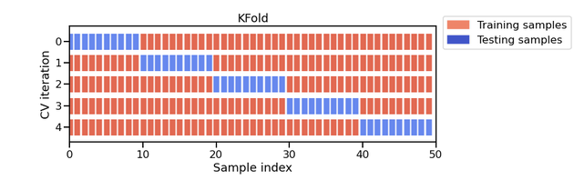
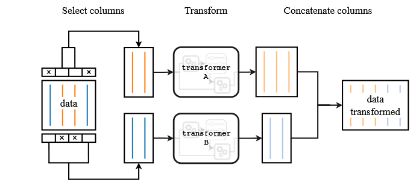

# Guide Complet : Introduction au Machine Learning avec Scikit-learn

## Table des matières
1. [Introduction générale au Machine Learning](#introduction)
2. [Exploration des données](#exploration)
3. [Premiers modèles avec K-Nearest Neighbors](#knn)
4. [Préparation des données numériques](#preprocessing-numerique)
5. [Validation croisée](#cross-validation)
6. [Gestion des données catégorielles](#donnees-categorielles)
7. [Combinaison des types de données](#donnees-mixtes)
8. [Modèles plus avancés](#modeles-avances)
9. [Bonnes pratiques et recommandations](#bonnes-pratiques)

---

## 1. Introduction générale au Machine Learning {#introduction}

### Qu'est-ce que le Machine Learning ?

Le **Machine Learning** (apprentissage automatique) est une branche de l'intelligence artificielle qui permet aux ordinateurs d'apprendre à partir de données sans être explicitement programmés pour chaque tâche spécifique.

### Concepts fondamentaux

#### **Features (Caractéristiques)**
- Ce sont les **variables d'entrée** de votre modèle
- Équivalent aux paramètres d'une fonction en programmation
- Exemple : âge, salaire, heures travaillées par semaine

#### **Target (Cible)**
- C'est la **variable de sortie** que vous voulez prédire
- Équivalent au résultat d'une fonction
- Exemple : classe de revenu (<=50K ou >50K)

#### **Dataset (Jeu de données)**
- Collection d'exemples avec leurs features et targets
- Équivalent à un tableau de données structurées

### Types de problèmes ML

#### **Classification**
- Prédire une **catégorie** ou **classe**
- Exemple : spam ou non-spam, espèce de pingouin, niveau de revenu
- Résultat : valeur discrète (catégorie)

#### **Régression**
- Prédire une **valeur numérique continue**
- Exemple : prix d'une maison, température demain
- Résultat : valeur continue (nombre)

---

## 2. Exploration des données {#exploration}

### Pourquoi explorer les données ?

Avant de construire un modèle, il faut **comprendre ses données**. C'est comme analyser le code d'une application avant de l'améliorer.

### Étapes d'exploration

#### **1. Chargement des données**
```python
import pandas as pd
penguins = pd.read_csv("../datasets/penguins_classification.csv")
```

#### **2. Inspection initiale**
```python
penguins.head()  # Affiche les premières lignes
penguins.info()  # Informations sur les colonnes
penguins.describe()  # Statistiques descriptives
```

#### **3. Analyse des types de données**

**Données numériques :**
- Nombres entiers ou décimaux
- Peuvent être mesurés, additionnés, moyennés
- Exemples : âge, longueur, poids

**Données catégorielles :**
- Catégories ou labels
- Ne peuvent pas être additionnées
- Exemples : couleur, sexe, espèce

#### **4. Distribution des classes**
```python
penguins["Species"].value_counts()
```
- Vérifie s'il y a un **déséquilibre** entre les classes
- Important pour évaluer la performance du modèle

#### **5. Visualisation**
```python
import matplotlib.pyplot as plt
penguins[numerical_columns].hist(bins=20, figsize=(10, 4))
```
- Histogrammes pour comprendre la distribution
- Aide à identifier les patterns et anomalies


---

## 3. Premiers modèles avec K-Nearest Neighbors {#knn}

### Qu'est-ce que K-Nearest Neighbors (KNN) ?

KNN est un algorithme simple qui **classe un nouvel exemple** en regardant ses **k plus proches voisins** dans l'espace des features.

### Métaphore simple
Imaginez que vous déménagez dans un nouveau quartier. Pour savoir si c'est un bon quartier, vous regardez vos k plus proches voisins :
- Si la majorité sont sympas → quartier sympa
- Si la majorité ne sont pas sympas → quartier pas sympa

### API Scikit-learn

Tous les modèles scikit-learn suivent la même **API** (interface) :

#### **1. Création du modèle**
```python
from sklearn.neighbors import KNeighborsClassifier
model = KNeighborsClassifier(n_neighbors=50)
```

#### **2. Entraînement**
```python
model.fit(X_train, y_train)  # X = features, y = target
```

#### **3. Prédiction**
```python
predictions = model.predict(X_test)
```

#### **4. Évaluation**
```python
accuracy = model.score(X_test, y_test)
```

### Paramètres importants

#### **n_neighbors**
- Nombre de voisins à considérer
- Valeur par défaut : 5
- Plus k est grand → modèle plus "lisse" mais moins précis
- Plus k est petit → modèle plus précis mais risque de "sur-apprentissage"

### Métriques d'évaluation

#### **Accuracy (Précision)**
- Pourcentage de prédictions correctes
- Formule : `(prédictions correctes) / (total des prédictions)`
- Exemple : 0.83 = 83% de bonnes prédictions

---

## 4. Préparation des données numériques {#preprocessing-numerique}

### Pourquoi preprocesser les données ?

Les données brutes ne sont pas toujours dans le bon format pour les algorithmes ML. C'est comme nettoyer et formater des données avant de les utiliser dans une application.

### Identification des données numériques

```python
# Vérifier les types de données
data.dtypes

# Sélectionner uniquement les colonnes numériques
numerical_columns = ["age", "capital-gain", "capital-loss", "hours-per-week"]
data_numeric = data[numerical_columns]
```

### Train-Test Split

#### **Pourquoi séparer les données ?**
- **Entraînement** : données pour apprendre
- **Test** : données pour évaluer (jamais vues pendant l'entraînement)
- Évite le **surapprentissage** (overfitting)

#### **Métaphore**
C'est comme étudier avec un livre d'exercices :
- Vous vous entraînez sur les exercices
- Vous évaluez vos connaissances sur l'examen (différent des exercices)

```python
from sklearn.model_selection import train_test_split
X_train, X_test, y_train, y_test = train_test_split(
    data_numeric, target, 
    test_size=0.25,      # 25% pour le test
    random_state=42      # Pour des résultats reproductibles
)
```

### Normalisation des données

#### **Problème**
Les features peuvent avoir des échelles très différentes :
- Âge : 20-90
- Salaire : 0-100000
- Heures/semaine : 0-100

#### **Solution : StandardScaler**
```python
from sklearn.preprocessing import StandardScaler
scaler = StandardScaler()
X_train_scaled = scaler.fit_transform(X_train)
```

#### **Ce que fait StandardScaler**
- Transforme chaque feature pour avoir :
  - Moyenne = 0
  - Écart-type = 1
- Formule : `(valeur - moyenne) / écart-type`


#### **Pourquoi normaliser ?**
1. **Algorithmes basés sur la distance** (comme KNN) : toutes les features contribuent équitablement
2. **Algorithmes d'optimisation** : convergence plus rapide
3. **Stabilité numérique** : évite les problèmes de calcul

### Pipelines

#### **Qu'est-ce qu'un Pipeline ?**
Un pipeline **enchaîne automatiquement** les étapes de preprocessing et d'entraînement.

```python
from sklearn.pipeline import make_pipeline
model = make_pipeline(StandardScaler(), LogisticRegression())
```

#### **Avantages**
- **Automatisation** : pas besoin de scaler manuellement
- **Évite les erreurs** : pas de fuite de données entre train/test
- **Code plus propre** : une seule ligne pour tout faire

#### **Fonctionnement interne**
1. **Fit** : apprend les paramètres de scaling sur train, puis entraîne le modèle
2. **Predict** : applique le même scaling sur test, puis prédit


---

## 5. Validation croisée {#cross-validation}

### Problème avec un seul train-test split

Un seul split peut donner des résultats **biaisés** selon comment les données sont divisées.

### Qu'est-ce que la validation croisée ?

La validation croisée **répète** l'entraînement/test avec différentes divisions des données.

#### **K-Fold Cross-Validation**
1. Divise les données en **k parties** (folds)
2. Utilise k-1 parties pour l'entraînement
3. Utilise 1 partie pour le test
4. Répète k fois en changeant la partie test
5. Calcule la moyenne des k performances



### Métaphore
C'est comme passer plusieurs examens blancs avant l'examen final :
- Chaque examen blanc utilise des questions différentes
- Votre niveau réel = moyenne de tous les examens blancs

### Implémentation

```python
from sklearn.model_selection import cross_validate
cv_results = cross_validate(model, X, y, cv=5)  # 5-fold
scores = cv_results["test_score"]
print(f"Accuracy: {scores.mean():.3f} ± {scores.std():.3f}")
```

### Avantages
- **Estimation plus robuste** de la performance
- **Mesure de l'incertitude** (écart-type)
- **Utilise toutes les données** pour l'entraînement et le test

### Inconvénients
- **Plus coûteux** en temps de calcul (k fois plus long)
- **Plus complexe** à interpréter

---

## 6. Gestion des données catégorielles {#donnees-categorielles}

### Problème
Les algorithmes ML ne comprennent que les **nombres**. Il faut convertir les catégories en nombres.

### Types d'encodage

#### **1. Ordinal Encoding**
Assigne un **nombre entier** à chaque catégorie.

```python
from sklearn.preprocessing import OrdinalEncoder
encoder = OrdinalEncoder(handle_unknown="use_encoded_value", unknown_value=-1)
```

**Exemple :**
- "Rouge" → 0
- "Vert" → 1  
- "Bleu" → 2

**Problème :** Crée un ordre artificiel (Rouge < Vert < Bleu)

#### **2. One-Hot Encoding**
Crée une **colonne binaire** pour chaque catégorie.

```python
from sklearn.preprocessing import OneHotEncoder
encoder = OneHotEncoder(handle_unknown="ignore", sparse_output=False)
```

**Exemple :**
- "Rouge" → [1, 0, 0]
- "Vert" → [0, 1, 0]
- "Bleu" → [0, 0, 1]

**Avantage :** Pas d'ordre artificiel

### Quand utiliser quel encodage ?

#### **One-Hot Encoding**
- **Modèles linéaires** (Logistic Regression, SVM)
- **Catégories sans ordre naturel**
- Plus sûr mais plus lent

#### **Ordinal Encoding**
- **Modèles basés sur les arbres** (Random Forest, Gradient Boosting)
- **Catégories avec ordre naturel** (Petit, Moyen, Grand)
- Plus rapide mais peut être problématique

### Comparaison pratique

```python
# Modèle avec Ordinal Encoding
ordinal_model = make_pipeline(
    OrdinalEncoder(handle_unknown="use_encoded_value", unknown_value=-1),
    LogisticRegression()
)

# Modèle avec One-Hot Encoding  
onehot_model = make_pipeline(
    OneHotEncoder(handle_unknown="ignore", sparse_output=False),
    LogisticRegression()
)
```

**Résultats typiques :**
- Ordinal + Logistic Regression : ~75% accuracy
- One-Hot + Logistic Regression : ~83% accuracy

---

## 7. Combinaison des types de données {#donnees-mixtes}

### Problème réel
Les datasets contiennent souvent **à la fois** des données numériques et catégorielles.

### Solution : ColumnTransformer

Le `ColumnTransformer` applique **différents preprocessings** à différentes colonnes.

```python
from sklearn.compose import ColumnTransformer
from sklearn.preprocessing import StandardScaler, OneHotEncoder

preprocessor = ColumnTransformer([
    ("num", StandardScaler(), numerical_columns),
    ("cat", OneHotEncoder(handle_unknown="ignore"), categorical_columns)
])
```

### Sélection automatique des colonnes

```python
from sklearn.compose import make_column_selector as selector

numerical_selector = selector(dtype_exclude=object)
categorical_selector = selector(dtype_include=object)

numerical_columns = numerical_selector(data)
categorical_columns = categorical_selector(data)
```

### Pipeline complet

```python
from sklearn.pipeline import make_pipeline
from sklearn.linear_model import LogisticRegression

model = make_pipeline(
    preprocessor,
    LogisticRegression(max_iter=500)
)
```

### Fonctionnement interne

1. **Division** : sépare les colonnes par type
2. **Transformation** : applique le preprocessing approprié à chaque groupe
3. **Concaténation** : combine les résultats en un seul dataset
4. **Entraînement** : entraîne le modèle sur les données préprocessées



---

## 8. Modèles plus avancés {#modeles-avances}

### Gradient Boosting

#### **Qu'est-ce que c'est ?**
Ensemble de **petits arbres de décision** qui se corrigent mutuellement.

#### **Métaphore**
C'est comme une équipe de consultants :
- Chaque consultant (arbre) fait une prédiction
- Les consultants suivants corrigent les erreurs des précédents
- La décision finale = combinaison de toutes les opinions

#### **Avantages**
- **Très performant** sur les données tabulaires
- **Gère bien** les données mixtes (numériques + catégorielles)
- **Moins sensible** au preprocessing

#### **Implémentation**
```python
from sklearn.ensemble import HistGradientBoostingClassifier

# Preprocessing simplifié pour les arbres
preprocessor = ColumnTransformer([
    ("cat", OrdinalEncoder(handle_unknown="use_encoded_value", unknown_value=-1), 
     categorical_columns)
], remainder="passthrough")

model = make_pipeline(preprocessor, HistGradientBoostingClassifier())
```

### Comparaison des modèles

| Modèle | Avantages | Inconvénients | Quand utiliser |
|--------|-----------|---------------|----------------|
| **Logistic Regression** | Rapide, interprétable, baseline solide | Assume relations linéaires | Problèmes simples, baseline |
| **K-Nearest Neighbors** | Simple, pas d'assumptions | Lent sur gros datasets | Petits datasets, prototypage |
| **Gradient Boosting** | Très performant, robuste | Plus complexe, risque d'overfitting | Compétitions, haute performance |

---

## 9. Bonnes pratiques et recommandations {#bonnes-pratiques}

### Workflow ML typique

1. **Exploration des données**
   - Comprendre le problème
   - Analyser les features et target
   - Identifier les types de données

2. **Preprocessing**
   - Gérer les valeurs manquantes
   - Encoder les variables catégorielles
   - Normaliser les variables numériques

3. **Modélisation**
   - Commencer par des modèles simples (baseline)
   - Utiliser la validation croisée
   - Tester des modèles plus complexes

4. **Évaluation**
   - Comparer avec des baselines
   - Utiliser des métriques appropriées
   - Évaluer sur des données non vues

### Choix du preprocessing

#### **Pour les modèles linéaires :**
- **Toujours** normaliser les features numériques
- **Toujours** utiliser One-Hot Encoding pour les catégories

#### **Pour les modèles basés sur les arbres :**
- Normalisation **optionnelle** (pas nécessaire)
- Ordinal Encoding **suffit** pour les catégories

### Métriques d'évaluation

#### **Accuracy**
- Pourcentage de prédictions correctes
- **Attention** : peut être trompeuse avec des classes déséquilibrées

#### **Baseline models**
Toujours comparer avec des modèles simples :
- **Dummy Classifier** : prédit toujours la classe majoritaire
- **Logistic Regression** : baseline standard

### Validation

#### **Cross-validation**
- **Toujours** utiliser pour l'évaluation finale
- **5-fold** ou **10-fold** sont des choix standards
- Donne une estimation plus robuste

#### **Train-Test Split**
- Utiliser **uniquement** pour l'exploration rapide
- **Jamais** pour l'évaluation finale

### Erreurs communes à éviter

1. **Data leakage** : utiliser des informations du test dans l'entraînement
2. **Overfitting** : modèle trop complexe qui mémorise les données
3. **Sous-estimer les baselines** : toujours comparer avec des modèles simples
4. **Ignorer le preprocessing** : la qualité des données = qualité du modèle

### Conseils pratiques

1. **Commencer simple** : baseline models d'abord
2. **Itérer rapidement** : tester plusieurs approches
3. **Documenter** : noter ce qui marche et ce qui ne marche pas
4. **Visualiser** : graphiques pour comprendre les données et résultats

---

## Conclusion

Le Machine Learning suit une **méthodologie rigoureuse** :
- **Comprendre** les données avant de modéliser
- **Preprocesser** selon le type de modèle
- **Valider** avec des méthodes robustes
- **Comparer** avec des baselines

Les outils comme scikit-learn fournissent une **API cohérente** qui facilite l'expérimentation et la mise en production.

Le plus important : **commencer simple** et **itérer**. La complexité viendra naturellement avec l'expérience.