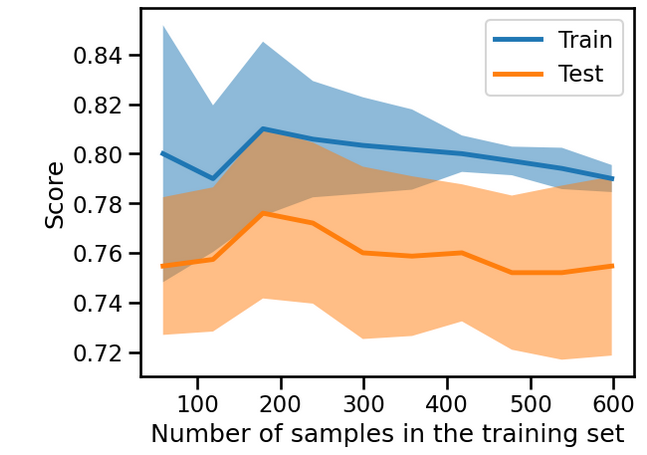

# Guide Module 2 : Overfitting, Underfitting et Validation avec Scikit-learn

## Table des matières
1. [Overfitting vs Underfitting](#overfitting-underfitting)
2. [Courbe de validation](#courbe-validation)
3. [Effet de la taille de l'échantillon](#effet-taille-echantillon)
4. [Courbe d'apprentissage](#courbe-apprentissage)
5. [Exercice pratique : SVM](#exercice-svm)
6. [Bonnes pratiques](#bonnes-pratiques)

---

## 1. Overfitting vs Underfitting {#overfitting-underfitting}

### Concepts fondamentaux

Dans le module précédent, nous avons présenté la validation croisée et comment elle nous aide à quantifier les erreurs d'entraînement et de test. Maintenant, nous allons mettre ces deux erreurs en perspective pour comprendre si notre modèle généralise bien, fait du surapprentissage (overfitting) ou du sous-apprentissage (underfitting).

### Préparation des données

```python
from sklearn.datasets import fetch_california_housing
housing = fetch_california_housing(as_frame=True)
data, target = housing.data, housing.target
target *= 100  # rescale the target in k$

from sklearn.tree import DecisionTreeRegressor
regressor = DecisionTreeRegressor()
```

### Analyse des erreurs d'entraînement vs test

Pour mieux comprendre les performances de généralisation de notre modèle, nous comparons l'erreur de test avec l'erreur d'entraînement en utilisant `cross_validate` avec `return_train_score=True`.

```python
import pandas as pd
from sklearn.model_selection import cross_validate, ShuffleSplit

cv = ShuffleSplit(n_splits=30, test_size=0.2, random_state=0)
cv_results = cross_validate(
    regressor,
    data,
    target,
    cv=cv,
    scoring="neg_mean_absolute_error",
    return_train_score=True,
    n_jobs=2,
)
cv_results = pd.DataFrame(cv_results)
```

### Visualisation des erreurs

```python
scores = pd.DataFrame()
scores[["train error", "test error"]] = -cv_results[
    ["train_score", "test_score"]
]

import matplotlib.pyplot as plt
scores.plot.hist(bins=50, edgecolor="black")
plt.xlabel("Mean absolute error (k$)")
_ = plt.title("Train and test errors distribution via cross-validation")
```

Histogramme montrant la distribution des erreurs d'entraînement et de test

### Interprétation des résultats

En traçant la distribution des erreurs d'entraînement et de test, nous obtenons des informations sur le comportement de notre modèle :

- **Erreur d'entraînement faible (proche de zéro)** : Le modèle n'est pas en sous-apprentissage, il est suffisamment flexible pour capturer les variations présentes dans l'ensemble d'entraînement.

- **Erreur de test significativement plus élevée** : Le modèle fait du surapprentissage, il a mémorisé de nombreuses variations de l'ensemble d'entraînement qui peuvent être considérées comme du "bruit" car elles ne généralisent pas bien sur l'ensemble de test.

---

## 2. Courbe de validation {#courbe-validation}

### Qu'est-ce qu'un hyperparamètre ?

Les **hyperparamètres** sont des paramètres qui impactent potentiellement le résultat de l'apprentissage et les prédictions ultérieures. Exemples :
- Le nombre de voisins dans un modèle k-NN
- Le degré d'un polynôme
- La profondeur maximale d'un arbre de décision

### Création d'une courbe de validation

Pour l'arbre de décision, l'hyperparamètre `max_depth` contrôle le compromis entre sous-apprentissage et surapprentissage.

```python
import numpy as np
from sklearn.model_selection import ValidationCurveDisplay

max_depth = np.array([1, 5, 10, 15, 20, 25])
disp = ValidationCurveDisplay.from_estimator(
    regressor,
    data,
    target,
    param_name="max_depth",
    param_range=max_depth,
    cv=cv,
    scoring="neg_mean_absolute_error",
    negate_score=True,
    std_display_style="errorbar",
    n_jobs=2,
)
_ = disp.ax_.set(
    xlabel="Maximum depth of decision tree",
    ylabel="Mean absolute error (k$)",
    title="Validation curve for decision tree",
)
```

Courbe de validation montrant l'erreur d'entraînement et de test en fonction de max_depth


### Interprétation de la courbe de validation

La courbe de validation peut être divisée en trois zones :

#### **Zone 1 : max_depth < 10 (Sous-apprentissage)**
- L'arbre de décision est en sous-apprentissage
- Les erreurs d'entraînement et de test sont toutes deux élevées
- Le modèle est trop contraint et ne peut pas capturer la variabilité de la variable cible

#### **Zone 2 : max_depth ≈ 10 (Équilibre optimal)**
- Cette région correspond au paramètre pour lequel l'arbre généralise le mieux
- Il est suffisamment flexible pour capturer une partie de la variabilité qui généralise
- Sans mémoriser tout le bruit de la cible

#### **Zone 3 : max_depth > 10 (Surapprentissage)**
- L'arbre de décision fait du surapprentissage
- L'erreur d'entraînement devient très faible
- L'erreur de test augmente
- Le modèle crée des décisions spécifiques aux échantillons bruités

### Qu'est-ce que le bruit ?

Dans ce contexte, nous parlons du fait que les datasets peuvent contenir du bruit. Il peut y avoir plusieurs types de bruit :

#### **Sources de bruit :**
- **Imprécision de mesure** d'un capteur physique (température, etc.)
- **Erreurs de saisie** par des collecteurs humains
- **Caractéristiques manquantes** : absence de mesure d'une caractéristique pertinente

#### **Exemple concret :**
Lors de la prédiction du prix d'une maison :
- La surface impactera sûrement le prix
- Mais le prix sera aussi influencé par l'urgence du vendeur
- Un modèle peut faire des prédictions basées sur la surface mais pas sur l'urgence
- L'urgence du vendeur devient donc une source de bruit

---

## 3. Effet de la taille de l'échantillon {#effet-taille-echantillon}

### Importance de la taille de l'échantillon

Au-delà des aspects de sous-apprentissage et de surapprentissage, il est important de comprendre comment les différentes erreurs sont influencées par le nombre d'échantillons disponibles.

### Préparation de l'expérience

```python
from sklearn.datasets import fetch_california_housing
housing = fetch_california_housing(as_frame=True)
data, target = housing.data, housing.target
target *= 100  # rescale the target in k$

from sklearn.tree import DecisionTreeRegressor
regressor = DecisionTreeRegressor()
```

---

## 4. Courbe d'apprentissage {#courbe-apprentissage}

### Qu'est-ce qu'une courbe d'apprentissage ?

Pour comprendre l'impact du nombre d'échantillons disponibles pour l'entraînement sur les performances de généralisation, nous pouvons synthétiquement réduire le nombre d'échantillons utilisés et vérifier les erreurs d'entraînement et de test.

La **courbe d'apprentissage** varie le nombre d'échantillons d'entraînement au lieu de varier un hyperparamètre.

### Création de la courbe d'apprentissage

```python
import numpy as np
train_sizes = np.linspace(0.1, 1.0, num=5, endpoint=True)

from sklearn.model_selection import ShuffleSplit
cv = ShuffleSplit(n_splits=30, test_size=0.2)

from sklearn.model_selection import LearningCurveDisplay
display = LearningCurveDisplay.from_estimator(
    regressor,
    data,
    target,
    train_sizes=train_sizes,
    cv=cv,
    score_type="both",  # both train and test errors
    scoring="neg_mean_absolute_error",
    negate_score=True,
    score_name="Mean absolute error (k$)",
    std_display_style="errorbar",
    n_jobs=2,
)
_ = display.ax_.set(xscale="log", title="Learning curve for decision tree")
```

Courbe d'apprentissage montrant l'évolution des erreurs en fonction du nombre d'échantillons



### Interprétation de la courbe d'apprentissage

#### **Erreur d'entraînement**
- Nous obtenons une erreur de 0 k$
- Le modèle entraîné (arbre de décision) fait clairement du surapprentissage

#### **Erreur de test**
- Plus d'échantillons sont ajoutés à l'ensemble d'entraînement, plus l'erreur de test diminue
- Nous recherchons le plateau de l'erreur de test où il n'y a plus de bénéfice à ajouter des échantillons

#### **Plateau et erreur de Bayes**
Si l'erreur de test atteint un plateau malgré l'ajout d'échantillons :
- Le modèle a peut-être atteint ses performances optimales
- Utiliser un modèle plus expressif pourrait aider
- L'erreur peut avoir atteint le **taux d'erreur de Bayes** (erreur théorique minimale)

---

## 5. Exercice pratique : SVM {#exercice-svm}

### Objectif de l'exercice

L'objectif est de faire les expériences suivantes :
- Entraîner et tester un classificateur SVM par validation croisée
- Étudier l'effet du paramètre gamma avec une courbe de validation
- Utiliser une courbe d'apprentissage pour déterminer l'utilité d'ajouter de nouveaux échantillons

### Chargement des données

```python
import pandas as pd
blood_transfusion = pd.read_csv("../datasets/blood_transfusion.csv")
data = blood_transfusion.drop(columns="Class")
target = blood_transfusion["Class"]
```

### Création du pipeline SVM

```python
from sklearn.pipeline import make_pipeline
from sklearn.preprocessing import StandardScaler
from sklearn.svm import SVC

model = make_pipeline(StandardScaler(), SVC())
```

### Évaluation par validation croisée

```python
from sklearn.model_selection import ShuffleSplit, cross_validate

cv = ShuffleSplit(n_splits=5, test_size=0.2, random_state=0)
cv_results = cross_validate(model, data, target, cv=cv, return_train_score=True)

print("Test accuracy scores:", cv_results['test_score'])
print("Mean test accuracy:", cv_results['test_score'].mean())
```

**Résultats :**
- Test accuracy scores: [0.74, 0.73333333, 0.8, 0.79333333, 0.70666667]
- Mean test accuracy: 0.7546666666666667

### Courbe de validation pour le paramètre gamma

```python
import numpy as np
from sklearn.model_selection import ValidationCurveDisplay

param_range = np.logspace(-3, 2, num=30)
ValidationCurveDisplay.from_estimator(
    model,
    data,
    target,
    param_name="svc__gamma",
    param_range=param_range,
    cv=cv,
    scoring=None,
    n_jobs=-1
)
```

Courbe de validation pour le paramètre gamma du SVM

### Courbe d'apprentissage pour SVM

```python
from sklearn.model_selection import LearningCurveDisplay

LearningCurveDisplay.from_estimator(
    model,
    data,
    target,
    train_sizes=np.linspace(0.1, 1.0, 10),
    cv=cv,
    scoring=None,
    n_jobs=-1
)
```

Courbe d'apprentissage du SVM

---

## 6. Bonnes pratiques {#bonnes-pratiques}

### Stratégies pour éviter le surapprentissage

#### **1. Sélection de modèles appropriés**
- Choisir des modèles suffisamment simples
- Ajuster les hyperparamètres correctement

#### **2. Augmentation des données**
- Collecter un plus grand nombre d'échantillons étiquetés
- Utiliser des techniques d'augmentation de données

### Workflow d'analyse

#### **1. Diagnostic du modèle**
- Comparer les erreurs d'entraînement et de test
- Identifier si le modèle fait du sous-apprentissage ou du surapprentissage

#### **2. Optimisation des hyperparamètres**
- Utiliser des courbes de validation
- Trouver le bon équilibre entre biais et variance

#### **3. Évaluation de la taille des données**
- Utiliser des courbes d'apprentissage
- Déterminer si plus de données seraient bénéfiques

### Recommandations pratiques

#### **Pour les modèles qui sous-apprennent :**
- Augmenter la complexité du modèle
- Réduire la régularisation
- Ajouter des features

#### **Pour les modèles qui sur-apprennent :**
- Réduire la complexité du modèle
- Augmenter la régularisation
- Collecter plus de données
- Utiliser des techniques d'ensemble

---

## Conclusion

Ce module nous a permis de comprendre :

### **Concepts clés**
- **Overfitting** : Le modèle mémorise le bruit des données d'entraînement
- **Underfitting** : Le modèle est trop simple pour capturer les patterns
- **Généralisation** : Capacité du modèle à performer sur de nouvelles données

### **Outils d'analyse**
- **Courbes de validation** : Analyser l'effet des hyperparamètres
- **Courbes d'apprentissage** : Évaluer l'impact de la taille des données
- **Validation croisée** : Estimation robuste des performances

### **Méthodologie**
1. Diagnostiquer le comportement du modèle
2. Ajuster les hyperparamètres appropriés
3. Évaluer le besoin en données supplémentaires
4. Itérer jusqu'à obtenir un bon équilibre

La maîtrise de ces concepts est essentielle pour développer des modèles ML robustes et performants en production.