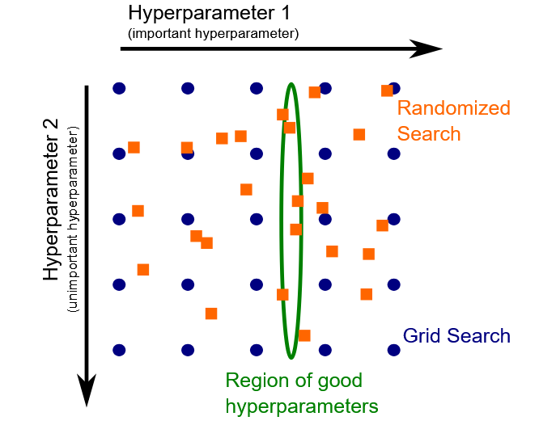

# Guide Module 3 : Hyperparameter Tuning with Scikit-learn

## Table des matières
1. [Introduction aux hyperparamètres](#introduction-hyperparametres)
2. [Get et Set des hyperparamètres](#get-set-hyperparametres)
3. [Recherche exhaustive manuelle](#recherche-exhaustive)
4. [Grid Search automatique](#grid-search)
5. [Randomized Search](#randomized-search)
6. [Évaluation avec hyperparameter tuning](#evaluation-tuning)
7. [Exercices pratiques](#exercices-pratiques)
8. [Bonnes pratiques](#bonnes-pratiques)

---

## 1. Introduction aux hyperparamètres {#introduction-hyperparametres}

### Qu'est-ce qu'un hyperparamètre ?

Les **hyperparamètres** sont des paramètres qui contrôlent le processus d'apprentissage d'un modèle prédictif et sont spécifiques à chaque famille de modèles. Contrairement aux paramètres du modèle (comme `coef_` pour les modèles linéaires), les hyperparamètres :

- Sont **spécifiés par l'utilisateur**
- Sont souvent **ajustés manuellement** ou par recherche automatique
- **Ne peuvent pas être estimés** à partir des données
- **Impactent la performance** de généralisation du modèle

### Exemples d'hyperparamètres

#### **K-Nearest Neighbors**
- `n_neighbors` : nombre de voisins à considérer (défaut : 5)

#### **Logistic Regression**
- `C` : force de régularisation inverse (défaut : 1.0)

#### **HistGradientBoostingClassifier**
- `learning_rate` : vitesse d'apprentissage
- `max_leaf_nodes` : nombre maximum de feuilles par arbre
- `l2_regularization` : force de régularisation L2

### Pourquoi optimiser les hyperparamètres ?

Les valeurs par défaut ne sont **pas nécessairement optimales** pour votre dataset spécifique. L'optimisation des hyperparamètres peut considérablement améliorer les performances de généralisation.

---

## 2. Get et Set des hyperparamètres {#get-set-hyperparametres}

### Obtenir les hyperparamètres

Tous les estimateurs scikit-learn proposent la méthode `get_params()` :

```python
from sklearn.linear_model import LogisticRegression
from sklearn.pipeline import Pipeline
from sklearn.preprocessing import StandardScaler

model = Pipeline([
    ("preprocessor", StandardScaler()),
    ("classifier", LogisticRegression()),
])

# Lister tous les paramètres
for parameter in model.get_params():
    print(parameter)

# Obtenir un paramètre spécifique
C_value = model.get_params()["classifier__C"]
print(f"Valeur de C : {C_value}")
```

### Modifier les hyperparamètres

#### **Lors de la création**
```python
model = LogisticRegression(C=1e-3)
```

#### **Après la création avec set_params()**
```python
model.set_params(classifier__C=1e-3)
```

### Notation pour les Pipelines

Dans un Pipeline, les noms des hyperparamètres suivent le format :
`<nom_étape>__<nom_hyperparamètre>`

```python
# Pour un pipeline avec une étape "classifier"
model.set_params(classifier__C=0.1)
model.set_params(classifier__learning_rate=0.05)
```

### Exemple pratique : variation manuelle

```python
from sklearn.model_selection import cross_validate

for C in [1e-3, 1e-2, 1e-1, 1, 10]:
    model.set_params(classifier__C=C)
    cv_results = cross_validate(model, data, target)
    scores = cv_results["test_score"]
    print(f"C={C} : {scores.mean():.3f} ± {scores.std():.3f}")
```

---

## 3. Recherche exhaustive manuelle {#recherche-exhaustive}

### Principe

La recherche exhaustive teste **toutes les combinaisons possibles** d'hyperparamètres sur une grille définie.

### Implémentation avec boucles imbriquées

```python
import numpy as np
from sklearn.model_selection import cross_val_score

# Définir les valeurs à tester
learning_rates = [0.01, 0.1, 1, 10]
max_leaf_nodes_values = [3, 10, 30]

# Variables pour suivre les meilleurs paramètres
best_score = -np.inf
best_params = {}

# Boucles imbriquées pour recherche exhaustive
for learning_rate in learning_rates:
    for max_leaf_nodes in max_leaf_nodes_values:
        # Définir les paramètres
        model.set_params(
            classifier__learning_rate=learning_rate,
            classifier__max_leaf_nodes=max_leaf_nodes
        )
        
        # Évaluation par validation croisée
        cv_scores = cross_val_score(
            model, data_train, target_train, 
            cv=5, scoring='accuracy'
        )
        
        mean_score = cv_scores.mean()
        print(f"LR={learning_rate}, MLN={max_leaf_nodes} | Score: {mean_score:.4f}")
        
        # Mise à jour des meilleurs paramètres
        if mean_score > best_score:
            best_score = mean_score
            best_params = {
                'learning_rate': learning_rate,
                'max_leaf_nodes': max_leaf_nodes
            }

print(f"Meilleurs paramètres : {best_params}")
print(f"Meilleur score CV : {best_score:.4f}")
```

### Évaluation finale sur le test set

```python
# Appliquer les meilleurs paramètres
model.set_params(
    classifier__learning_rate=best_params['learning_rate'],
    classifier__max_leaf_nodes=best_params['max_leaf_nodes']
)

# Réentraîner sur l'ensemble d'entraînement complet
model.fit(data_train, target_train)

# Évaluer sur le test set
test_score = model.score(data_test, target_test)
print(f"Performance sur test set : {test_score:.4f}")
```

---

## 4. Grid Search automatique {#grid-search}

### GridSearchCV : automatisation de la recherche

`GridSearchCV` automatise le processus de recherche exhaustive avec moins de code répétitif.

```python
from sklearn.model_selection import GridSearchCV

# Définir la grille de paramètres
param_grid = {
    "classifier__learning_rate": (0.01, 0.1, 1, 10),
    "classifier__max_leaf_nodes": (3, 10, 30),
}

# Créer le grid search
model_grid_search = GridSearchCV(
    model, 
    param_grid=param_grid, 
    cv=5, 
    scoring="accuracy",
    n_jobs=2
)

# Entraîner et trouver les meilleurs paramètres
model_grid_search.fit(data_train, target_train)

# Résultats
print(f"Meilleurs paramètres : {model_grid_search.best_params_}")
print(f"Meilleur score CV : {model_grid_search.best_score_:.4f}")

# Évaluation sur test set
test_accuracy = model_grid_search.score(data_test, target_test)
print(f"Accuracy test : {test_accuracy:.4f}")
```

### Analyse des résultats

```python
import pandas as pd

# Examiner tous les résultats
cv_results = pd.DataFrame(model_grid_search.cv_results_)
cv_results = cv_results.sort_values("mean_test_score", ascending=False)

# Colonnes intéressantes
columns_of_interest = [
    "param_classifier__learning_rate",
    "param_classifier__max_leaf_nodes", 
    "mean_test_score", 
    "std_test_score", 
    "rank_test_score"
]

print(cv_results[columns_of_interest].head())
```

### Visualisation avec heatmap

```python
import seaborn as sns
import matplotlib.pyplot as plt

# Créer un tableau pivot pour la heatmap
pivot_results = cv_results.pivot_table(
    values="mean_test_score",
    index=["param_classifier__learning_rate"],
    columns=["param_classifier__max_leaf_nodes"]
)

# Créer la heatmap
plt.figure(figsize=(8, 6))
sns.heatmap(
    pivot_results, 
    annot=True, 
    cmap="YlGnBu", 
    cbar_kws={"label": "Mean test accuracy"}
)
plt.title("Grid Search Results")
plt.show()
```

### Limites du Grid Search

1. **Coût computationnel** : nombre de combinaisons = produit des nombres de valeurs
2. **Régularité imposée** : peut rater de bonnes valeurs entre les points de la grille
3. **Malédiction de la dimensionnalité** : devient impraticable avec >2-3 hyperparamètres

---

## 5. Randomized Search {#randomized-search}

### Avantages du Randomized Search

- **Budget fixe** via le paramètre `n_iter`
- **Évite la régularité** de la grille
- **Plus efficace** pour explorer de nombreux hyperparamètres
- **Échantillonnage intelligent** via des distributions



### Distributions pour l'échantillonnage

```python
from scipy.stats import loguniform

# Classe pour distributions log-uniformes entières
class loguniform_int:
    def __init__(self, a, b):
        self._distribution = loguniform(a, b)
    
    def rvs(self, *args, **kwargs):
        return self._distribution.rvs(*args, **kwargs).astype(int)
```

### Implémentation avec RandomizedSearchCV

```python
from sklearn.model_selection import RandomizedSearchCV

# Définir les distributions des paramètres
param_distributions = {
    "classifier__l2_regularization": loguniform(1e-6, 1e3),
    "classifier__learning_rate": loguniform(0.001, 10),
    "classifier__max_leaf_nodes": loguniform_int(2, 256),
    "classifier__min_samples_leaf": loguniform_int(1, 100),
    "classifier__max_bins": loguniform_int(2, 255),
}

# Créer le randomized search
model_random_search = RandomizedSearchCV(
    model,
    param_distributions=param_distributions,
    n_iter=50,  # Budget fixe
    cv=5,
    scoring="accuracy",
    random_state=42,
    n_jobs=-1
)

# Entraîner
model_random_search.fit(data_train, target_train)

# Résultats
print(f"Meilleurs paramètres : {model_random_search.best_params_}")
accuracy = model_random_search.score(data_test, target_test)
print(f"Accuracy test : {accuracy:.4f}")
```

### Comparaison Grid vs Random Search

| Aspect | Grid Search | Random Search |
|--------|-------------|---------------|
| **Couverture** | Exhaustive sur la grille | Échantillonnage aléatoire |
| **Coût** | Exponentiel avec nb paramètres | Contrôlé par `n_iter` |
| **Flexibilité** | Grille fixe | Distributions continues |
| **Recommandation** | ≤ 2 hyperparamètres | ≥ 3 hyperparamètres |

---

## 6. Évaluation avec hyperparameter tuning {#evaluation-tuning}

### Problème : data leakage dans l'évaluation

Quand on utilise les mêmes données pour :
1. **Sélectionner** les hyperparamètres
2. **Évaluer** le modèle final

→ **Risque de surestimation** des performances

### Solution : train/validation/test split

```python
from sklearn.model_selection import train_test_split

# Division en train/test
data_train, data_test, target_train, target_test = train_test_split(
    data, target, test_size=0.2, random_state=42
)

# Grid search sur train seulement
model_grid_search.fit(data_train, target_train)

# Évaluation finale sur test
final_score = model_grid_search.score(data_test, target_test)
```


### Validation croisée imbriquée (Nested CV)

Pour une évaluation plus robuste :

```python
from sklearn.model_selection import cross_validate

# Grid search comme estimateur dans cross_validate
cv_results = cross_validate(
    model_grid_search, 
    data, 
    target, 
    cv=5,
    scoring="accuracy",
    return_estimator=True
)

scores = cv_results["test_score"]
print(f"Performance généralisée : {scores.mean():.3f} ± {scores.std():.3f}")
```


### Analyse des hyperparamètres sélectionnés

```python
# Examiner les hyperparamètres choisis dans chaque fold
for i, estimator in enumerate(cv_results["estimator"]):
    print(f"Fold {i+1} : {estimator.best_params_}")
```

---

## 7. Exercices pratiques {#exercices-pratiques}

### Exercice 1 : K-Neighbors Regression

```python
from sklearn.datasets import fetch_california_housing
from sklearn.neighbors import KNeighborsRegressor
from sklearn.preprocessing import StandardScaler
from sklearn.pipeline import Pipeline

# Charger les données
data, target = fetch_california_housing(return_X_y=True, as_frame=True)
target *= 100  # en k$

# Créer le pipeline
model = Pipeline([
    ('scaler', StandardScaler()),
    ('regressor', KNeighborsRegressor())
])

# Grille de paramètres
param_grid = {
    'regressor__n_neighbors': np.logspace(0, 3, num=10).astype(np.int32),
    'scaler__with_mean': [True, False],
    'scaler__with_std': [True, False]
}

# RandomizedSearchCV
from sklearn.model_selection import RandomizedSearchCV

random_search = RandomizedSearchCV(
    model, 
    param_grid, 
    n_iter=20, 
    scoring="neg_mean_absolute_error",
    cv=5,
    random_state=42
)

random_search.fit(data_train, target_train)
print(f"Meilleurs paramètres : {random_search.best_params_}")
```

### Exercice 2 : SVM avec courbes de validation

```python
import pandas as pd
from sklearn.svm import SVC
from sklearn.model_selection import ValidationCurveDisplay

# Charger blood transfusion dataset
blood_transfusion = pd.read_csv("../datasets/blood_transfusion.csv")
data = blood_transfusion.drop(columns="Class")
target = blood_transfusion["Class"]

# Pipeline SVM
model = Pipeline([
    ('scaler', StandardScaler()),
    ('svm', SVC())
])

# Courbe de validation pour gamma
param_range = np.logspace(-3, 2, num=30)
ValidationCurveDisplay.from_estimator(
    model,
    data,
    target,
    param_name="svm__gamma",
    param_range=param_range,
    cv=5,
    scoring="accuracy"
)
plt.show()
```

---

## 8. Bonnes pratiques {#bonnes-pratiques}

### Choix de la stratégie de recherche

#### **Grid Search**
- **Quand utiliser** : ≤ 2-3 hyperparamètres
- **Avantages** : exhaustif, reproductible
- **Inconvénients** : coût exponentiel

#### **Random Search**  
- **Quand utiliser** : ≥ 3 hyperparamètres
- **Avantages** : budget contrôlé, distributions continues
- **Inconvénients** : non exhaustif

### Méthodologie d'optimisation

1. **Commencer simple** : tester quelques valeurs manuellement
2. **Grid search initial** : sur une grille grossière  
3. **Affiner localement** : autour des bonnes valeurs trouvées
4. **Random search** : pour explorer plus largement

### Éviter le surajustement

#### **Validation appropriée**
```python
# ❌ Mauvais : même données pour tuning et évaluation
grid_search.fit(data, target)
score = grid_search.score(data, target)  # Biaisé !

# ✅ Bon : données séparées
grid_search.fit(data_train, target_train)
score = grid_search.score(data_test, target_test)

# ✅ Encore mieux : validation croisée imbriquée
cv_scores = cross_validate(grid_search, data, target, cv=5)
```

#### **Budget de validation**
- Plus on teste de combinaisons, plus le risque de surajustement augmente
- Utiliser `n_iter` raisonnable dans RandomizedSearchCV
- Préserver un test set vraiment indépendant

### Métriques de scoring

#### **Classification**
- `accuracy` : pour classes équilibrées
- `balanced_accuracy` : pour classes déséquilibrées  
- `f1_macro` : moyenne des F1 par classe

#### **Régression**
- `neg_mean_absolute_error` : erreur absolue moyenne (négative)
- `neg_mean_squared_error` : erreur quadratique moyenne (négative)
- `r2` : coefficient de détermination

### Analyse des résultats

#### **Stabilité des hyperparamètres**
```python
# Vérifier la cohérence entre folds
for i, estimator in enumerate(cv_results["estimator"]):
    print(f"Fold {i+1}: {estimator.best_params_}")
    
# Si très variable → plus de données ou régularisation
```

#### **Visualisation**
- **Courbes de validation** : comprendre l'impact de chaque hyperparamètre
- **Heatmaps** : pour 2 hyperparamètres 
- **Parallel coordinates** : pour analyser de nombreuses combinaisons

### Considérations computationnelles

#### **Parallélisation**
```python
# Utiliser tous les cores disponibles
GridSearchCV(model, param_grid, n_jobs=-1)
```

#### **Validation croisée**
- `cv=5` : bon compromis vitesse/robustesse
- `cv=10` : plus robuste mais plus lent
- `cv=3` : rapide pour exploration initiale

### Reproductibilité

```python
# Toujours fixer les seeds pour la reproductibilité
RandomizedSearchCV(
    model, 
    param_distributions, 
    random_state=42,  # ← Important
    n_iter=50
)
```

---

## Conclusion

L'optimisation des hyperparamètres est cruciale pour obtenir des modèles performants :

### **Points clés à retenir**
- Les **valeurs par défaut** ne sont pas toujours optimales
- **Grid search** pour peu de paramètres, **random search** pour plus
- **Validation appropriée** pour éviter le data leakage  
- **Nested cross-validation** pour une évaluation robuste

### **Workflow recommandé**
1. **Exploration manuelle** : comprendre l'impact des hyperparamètres
2. **Grid search grossier** : identifier les bonnes régions
3. **Affinage local** : optimiser finement
4. **Évaluation finale** : sur données indépendantes

### **Outils scikit-learn**
- `get_params()` / `set_params()` : manipulation manuelle
- `GridSearchCV` : recherche exhaustive
- `RandomizedSearchCV` : recherche aléatoire
- `ValidationCurveDisplay` : visualisation de l'impact
- `cross_validate` : évaluation robuste

La maîtrise de ces techniques permet d'extraire le maximum de performance de vos modèles machine learning.