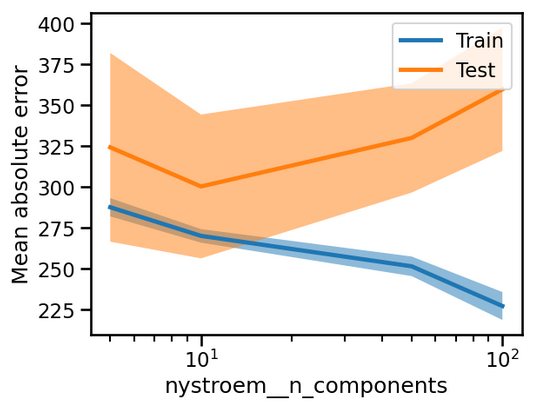

# Module 4 : Modèles Linéaires - Rapport Complet

## Table des Matières
1. [Introduction aux Modèles Linéaires](#introduction-aux-modèles-linéaires)
2. [Régression Linéaire sans Scikit-learn](#régression-linéaire-sans-scikit-learn)
3. [Modèles Linéaires pour la Classification](#modèles-linéaires-pour-la-classification)
4. [Ingénierie de Caractéristiques Non-linéaires](#ingénierie-de-caractéristiques-non-linéaires)
5. [Techniques de Régularisation](#techniques-de-régularisation)
6. [Méthodes d'Approximation de Noyaux](#méthodes-dapproximation-de-noyaux)
7. [Exercices Pratiques et Applications](#exercices-pratiques-et-applications)
8. [Évaluations et Quiz](#évaluations-et-quiz)

## Introduction aux Modèles Linéaires

Les modèles linéaires constituent une famille fondamentale d'algorithmes d'apprentissage automatique qui établissent des relations linéaires entre les caractéristiques d'entrée et la variable cible. Ce module explore en profondeur l'implémentation, l'utilisation et l'optimisation de ces modèles dans le contexte de scikit-learn.

### Concepts Fondamentaux

Les modèles linéaires s'appuient sur l'hypothèse que la relation entre les variables explicatives et la variable à prédire peut être exprimée sous forme d'une combinaison linéaire. Pour la régression, cette relation s'exprime comme :

```
y = a * x + b
```

où `a` représente la pente et `b` l'ordonnée à l'origine.

## Régression Linéaire sans Scikit-learn

### Implémentation Manuelle

Le module démarre par une approche pédagogique consistant à implémenter la régression linéaire sans utiliser scikit-learn, permettant de comprendre les mécanismes sous-jacents :

```python
import numpy as np
import matplotlib.pyplot as plt

# Implémentation manuelle de la régression linéaire
def fit_linear_regression(x, y):
    a = np.sum((x - x.mean()) * (y - y.mean())) / np.sum((x - x.mean()) ** 2)
    b = y.mean() - a * x.mean()
    return a, b

def predict_linear_regression(x, a, b):
    return a * x + b
```

Cette approche permet de visualiser clairement la paramétrisation du modèle et de comprendre comment les coefficients sont calculés.

### Transition vers Scikit-learn

L'introduction progressive de `sklearn.linear_model.LinearRegression` montre les avantages de l'utilisation d'une bibliothèque standardisée :

```python
from sklearn.linear_model import LinearRegression

model = LinearRegression()
model.fit(X_train, y_train)
y_pred = model.predict(X_test)
```

## Modèles Linéaires pour la Classification

### Régression Logistique

La régression logistique étend les concepts de la régression linéaire au domaine de la classification binaire. Le module explique en détail :

- **Fonction sigmoïde** : Transformation des scores linéaires en probabilités
- **Seuillage de décision** : Mécanisme de classification basé sur les probabilités
- **Frontières de décision** : Visualisation des zones de classification

```python
from sklearn.linear_model import LogisticRegression

# Exemple d'utilisation avec le dataset des pingouins
logistic_model = LogisticRegression()
logistic_model.fit(X_train, y_train)

# Visualisation des frontières de décision
from sklearn.inspection import DecisionBoundaryDisplay
DecisionBoundaryDisplay.from_estimator(logistic_model, X, alpha=0.8)
```


### Applications Pratiques

Le module utilise le dataset des pingouins pour illustrer concrètement l'application de la régression logistique, avec des visualisations détaillées des frontières de décision et de l'interprétation des coefficients.

## Ingénierie de Caractéristiques Non-linéaires

### Transformations Polynomiales

L'ingénierie de caractéristiques permet d'étendre les capacités des modèles linéaires en créant des transformations non-linéaires des données d'entrée :

```python
from sklearn.preprocessing import PolynomialFeatures

# Création de caractéristiques polynomiales
poly_features = PolynomialFeatures(degree=2, include_bias=False)
X_poly = poly_features.fit_transform(X)
```

Cette technique permet aux modèles linéaires de capturer des relations non-linéaires complexes dans les données.

### Visualisation des Effets

Le module inclut des visualisations détaillées montrant comment les transformations polynomiales modifient l'espace des caractéristiques et permettent de mieux ajuster les données complexes.



## Techniques de Régularisation

### Ridge Regression

La régularisation Ridge constitue une technique essentielle pour contrôler la complexité du modèle et prévenir le surajustement :

```python
from sklearn.linear_model import Ridge, RidgeCV

# Ridge avec validation croisée pour sélection d'alpha
ridge_cv = RidgeCV(alphas=np.logspace(-6, 6, 13))
ridge_cv.fit(X_train, y_train)

print(f"Meilleur alpha: {ridge_cv.alpha_}")
```

### Paramètre de Régularisation Alpha

Le module explore en profondeur l'impact du paramètre `alpha` :

- **Valeurs faibles** : Modèle proche de la régression linéaire classique
- **Valeurs élevées** : Forte régularisation, coefficients réduits
- **Sélection optimale** : Utilisation de la validation croisée


### Mise à l'Échelle des Caractéristiques

La régularisation nécessite une attention particulière à la mise à l'échelle :

```python
from sklearn.preprocessing import StandardScaler, MinMaxScaler

# Standardisation des caractéristiques
scaler = StandardScaler()
X_scaled = scaler.fit_transform(X)

# Alternative avec MinMaxScaler
minmax_scaler = MinMaxScaler()
X_normalized = minmax_scaler.fit_transform(X)
```

## Méthodes d'Approximation de Noyaux

### Méthode de Nyström

La méthode de Nyström permet d'approximer efficacement les noyaux non-linéaires tout en conservant les avantages computationnels des modèles linéaires :

```python
from sklearn.kernel_approximation import Nystroem

# Approximation RBF avec Nyström
nystroem = Nystroem(kernel='rbf', gamma=0.1, n_components=100)
X_nystroem = nystroem.fit_transform(X)
```


### Avantages et Applications

- **Efficacité computationnelle** : Réduction de la complexité par rapport aux SVM
- **Flexibilité** : Possibilité d'utiliser différents noyaux (RBF, polynomial)
- **Évolutivité** : Adaptation aux grands datasets

## Exercices Pratiques et Applications

### Dataset des Pingouins

Le module utilise extensivement le dataset des pingouins d'Adélie pour illustrer :

- Classification binaire avec régression logistique
- Impact de la sélection de caractéristiques
- Visualisation des frontières de décision
- Évaluation des performances

### Dataset de l'Immobilier

Les exercices avancés portent sur un dataset immobilier complet, intégrant :

- Preprocessing complexe avec `ColumnTransformer`
- Gestion des variables catégorielles et numériques
- Pipelines de transformation complètes
- Optimisation des hyperparamètres

```python
from sklearn.compose import ColumnTransformer
from sklearn.preprocessing import OneHotEncoder
from sklearn.pipeline import Pipeline

# Pipeline complet de preprocessing
preprocessor = ColumnTransformer(
    transformers=[
        ('num', StandardScaler(), numerical_features),
        ('cat', OneHotEncoder(), categorical_features)
    ]
)

# Pipeline complet avec modèle
full_pipeline = Pipeline([
    ('preprocessor', preprocessor),
    ('regressor', Ridge(alpha=1.0))
])
```

## Évaluations et Quiz

### Quiz Intermédiaires

Le module comprend plusieurs quiz évaluant la compréhension :

1. **Paramétrisation des modèles linéaires**
2. **Choix des métriques d'évaluation**
3. **Impact de la régularisation**
4. **Sélection des transformations de caractéristiques**

### Exercices de Synthèse

Les exercices finaux intègrent tous les concepts abordés :

- Comparaison de différentes approches de régularisation
- Analyse de l'impact des transformations non-linéaires
- Optimisation des pipelines de preprocessing
- Évaluation comparative des performances

## Concepts Clés et Bonnes Pratiques

### Points Essentiels

1. **Mise à l'échelle obligatoire** : Les modèles linéaires régularisés nécessitent une standardisation des caractéristiques
2. **Validation croisée** : Sélection des hyperparamètres par validation croisée systématique
3. **Ingénierie de caractéristiques** : Extension des capacités par transformations appropriées
4. **Interprétabilité** : Maintien de l'avantage interprétatif des modèles linéaires

### Recommandations Pratiques

- Commencer par des modèles simples avant d'ajouter de la complexité
- Utiliser `RidgeCV` pour la sélection automatique d'alpha
- Visualiser les frontières de décision pour comprendre le comportement du modèle
- Évaluer l'impact des transformations sur les performances

## Conclusion

Ce module offre une exploration complète des modèles linéaires, de leur implémentation fondamentale aux techniques avancées de régularisation et d'extension non-linéaire. Les concepts présentés constituent une base solide pour aborder des algorithmes plus complexes tout en conservant les avantages d'interprétabilité et d'efficacité computationnelle des approches linéaires.

L'approche pédagogique progressive, associée aux visualisations détaillées et aux exercices pratiques, permet une compréhension approfondie des mécanismes sous-jacents et de leur application dans des contextes réels d'analyse de données.