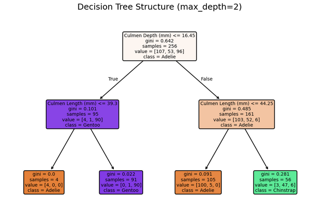

# Guide Module 5 : Arbres de Décision avec Scikit-learn

## Table des matières
1. [Introduction aux arbres de décision](#introduction-arbres)
2. [Arbres de décision pour la classification](#classification)
3. [Arbres de décision pour la régression](#regression)
4. [Capacité d'extrapolation des arbres](#extrapolation)
5. [Hyperparamètres importants des arbres de décision](#hyperparametres)
6. [Exercices pratiques](#exercices-pratiques)
7. [Bonnes pratiques](#bonnes-pratiques)

---

## 1. Introduction aux arbres de décision {#introduction-arbres}

### Qu'est-ce qu'un arbre de décision ?

Les **arbres de décision** sont des algorithmes d'apprentissage supervisé qui créent un modèle de prédiction sous forme d'arbre où :
- Chaque **nœud interne** représente un test sur une caractéristique
- Chaque **branche** représente le résultat du test
- Chaque **feuille** représente une prédiction (classe ou valeur)

### Domaines d'application

Les arbres de décision peuvent être utilisés pour :
- **Problèmes de classification** : prédire une classe/catégorie
- **Problèmes de régression** : prédire une valeur numérique continue

### Principe de fonctionnement

#### **Partitionnement de l'espace des caractéristiques**
- Les arbres partitionnent l'espace des caractéristiques en **rectangles**
- Chaque split considère **une seule caractéristique à la fois**
- La décision finale se base sur la **règle majoritaire** dans chaque partition

#### **Construction de l'arbre**
1. **Sélection du split** : choisir la caractéristique et le seuil qui **minimisent une mesure d'erreur**
2. **Division récursive** : répéter le processus sur chaque sous-ensemble
3. **Critères d'arrêt** : profondeur maximale, nombre minimum d'échantillons, etc.

---

## 2. Arbres de décision pour la classification {#classification}

### API Scikit-learn pour la classification

```python
from sklearn.tree import DecisionTreeClassifier

# Créer le modèle
tree_clf = DecisionTreeClassifier(max_depth=2, random_state=0)

# Entraîner le modèle
tree_clf.fit(X_train, y_train)

# Faire des prédictions
predictions = tree_clf.predict(X_test)

# Obtenir les probabilités
probabilities = tree_clf.predict_proba(X_test)
```

### Différences avec les modèles linéaires

#### **Modèles linéaires**
- Créent des **séparations obliques** (lignes droites dans l'espace 2D)
- Utilisent une **combinaison linéaire** de toutes les caractéristiques
- Supposent des **relations linéaires**

#### **Arbres de décision**
- Créent des **séparations perpendiculaires** aux axes
- Utilisent **une seule caractéristique** par split
- **Aucune supposition** sur la distribution des données (non-paramétriques)

### Visualisation des frontières de décision

Les arbres créent des **frontières rectangulaires** qui divisent l'espace en zones homogènes.

```python
from sklearn.inspection import DecisionBoundaryDisplay

# Visualiser la frontière de décision
DecisionBoundaryDisplay.from_estimator(
    tree_clf, X_train, 
    response_method="predict",
    cmap="RdBu", alpha=0.5
)
```

### Structure de l'arbre

```python
from sklearn.tree import plot_tree

# Visualiser la structure de l'arbre
plot_tree(tree_clf, 
         feature_names=feature_names,
         class_names=class_names,
         filled=True)
```

### Prédictions et probabilités

**Principe :** L'arbre prédit la **classe majoritaire** dans chaque feuille et calcule les probabilités basées sur la **proportion des classes** dans cette feuille.

---

## 3. Arbres de décision pour la régression {#regression}

### API Scikit-learn pour la régression

```python
from sklearn.tree import DecisionTreeRegressor

# Créer le modèle
tree_reg = DecisionTreeRegressor(max_depth=3, random_state=0)

# Entraîner le modèle
tree_reg.fit(X_train, y_train)

# Faire des prédictions
predictions = tree_reg.predict(X_test)
```

### Différences avec la régression linéaire

#### **Régression linéaire**
- Prédictions sur une **ligne continue**
- Suppose une **relation linéaire**
- **Paramétriques** (nombre fixe de paramètres)

#### **Arbres de régression**
- Prédictions **constantes par morceaux**
- **Aucune supposition** sur la forme de la relation
- **Non-paramétriques** (complexité croît avec les données)

### Mécanisme de prédiction

Dans chaque feuille, l'arbre prédit la **valeur moyenne** des échantillons d'entraînement qui atteignent cette feuille.

### Visualisation des prédictions

Les prédictions d'un arbre de régression forment une **fonction en escalier** où chaque "marche" correspond à une feuille de l'arbre.


---

## 4. Capacité d'extrapolation des arbres {#extrapolation}

### Problème d'extrapolation

Les arbres de décision ont une **capacité d'extrapolation limitée** :

#### **Régression linéaire**
- **Peut extrapoler** : continue la tendance linéaire au-delà des données d'entraînement
- Prédictions cohérentes avec la tendance observée

#### **Arbres de décision**  
- **Ne peuvent pas extrapoler** : font des prédictions constantes en dehors de la plage d'entraînement
- Prédisent les valeurs des feuilles les plus proches

### Implications pratiques

```python
# Exemple de limitation d'extrapolation
# Si l'arbre est entraîné sur des données de 100 à 200
# Il prédira des valeurs constantes pour :
# - x < 100 : valeur de la feuille la plus à gauche
# - x > 200 : valeur de la feuille la plus à droite
```


### Recommandations

1. **Utiliser des modèles linéaires** si l'extrapolation est importante
2. **Combiner plusieurs modèles** (ensembles) pour améliorer l'extrapolation
3. **Enrichir les données d'entraînement** pour couvrir la plage de prédiction souhaitée

---

## 5. Hyperparamètres importants des arbres de décision {#hyperparametres}

### max_depth : Contrôle de la profondeur

Le paramètre **max_depth** contrôle la complexité globale de l'arbre.

#### **Impact du max_depth**
- **Profondeur faible** : modèle simple, risque de sous-apprentissage
- **Profondeur élevée** : modèle complexe, risque de surapprentissage

```python
# Arbre peu profond (peut sous-apprendre)
shallow_tree = DecisionTreeClassifier(max_depth=2)

# Arbre profond (peut sur-apprendre)
deep_tree = DecisionTreeClassifier(max_depth=15)

# Optimisation via validation croisée
from sklearn.model_selection import GridSearchCV

param_grid = {'max_depth': range(1, 16)}
grid_search = GridSearchCV(
    DecisionTreeClassifier(random_state=0),
    param_grid, cv=5, scoring='accuracy'
)
```



### Autres hyperparamètres importants

#### **min_samples_leaf**
- Nombre minimum d'échantillons requis dans une feuille
- **Plus élevé** → modèle plus régularisé
- Permet de créer des arbres **asymétriques**

```python
tree = DecisionTreeClassifier(min_samples_leaf=20)
```

#### **min_samples_split**
- Nombre minimum d'échantillons requis pour diviser un nœud
- Contrôle la **granularité** des divisions

#### **max_leaf_nodes**
- Nombre maximum de feuilles dans l'arbre
- **Alternative à max_depth** pour contrôler la complexité

#### **min_impurity_decrease**
- Seuil minimum de réduction d'impureté pour effectuer un split
- **Plus élevé** → arbres plus simples

### Stratégies d'optimisation

#### **Recherche par grille**
```python
param_grid = {
    'max_depth': [3, 5, 7, 10],
    'min_samples_leaf': [1, 5, 10],
    'min_samples_split': [2, 5, 10]
}

grid_search = GridSearchCV(
    DecisionTreeClassifier(random_state=0),
    param_grid, cv=5
)
```

#### **Validation croisée imbriquée**
```python
from sklearn.model_selection import cross_validate

# Évaluation robuste avec validation croisée imbriquée
nested_scores = cross_validate(
    grid_search, X, y, cv=5, scoring='accuracy'
)
```

---

## 6. Exercices pratiques {#exercices-pratiques}

### Exercice 1 : Classification des pingouins

```python
import pandas as pd
from sklearn.tree import DecisionTreeClassifier
from sklearn.model_selection import train_test_split

# Charger les données
penguins = pd.read_csv("../datasets/penguins_classification.csv")
feature_names = ["Culmen Length (mm)", "Culmen Depth (mm)"]
target_name = "Species"

X = penguins[feature_names]
y = penguins[target_name]

# Division train/test
X_train, X_test, y_train, y_test = train_test_split(
    X, y, random_state=0
)

# Entraînement avec différentes profondeurs
for depth in [1, 2, 5]:
    tree = DecisionTreeClassifier(max_depth=depth, random_state=0)
    tree.fit(X_train, y_train)
    score = tree.score(X_test, y_test)
    print(f"Profondeur {depth}: Accuracy = {score:.3f}")
```

### Exercice 2 : Régression sur les données immobilières

```python
from sklearn.tree import DecisionTreeRegressor
from sklearn.linear_model import LinearRegression
import matplotlib.pyplot as plt

# Comparaison arbre vs régression linéaire
def compare_models(X_train, X_test, y_train, y_test):
    # Modèles
    tree_reg = DecisionTreeRegressor(max_depth=3, random_state=0)
    linear_reg = LinearRegression()
    
    # Entraînement
    tree_reg.fit(X_train, y_train)
    linear_reg.fit(X_train, y_train)
    
    # Prédictions
    tree_pred = tree_reg.predict(X_test)
    linear_pred = linear_reg.predict(X_test)
    
    # Visualisation
    plt.scatter(X_test, y_test, alpha=0.5, label='Données réelles')
    plt.plot(X_test, tree_pred, 'r-', label='Arbre de décision')
    plt.plot(X_test, linear_pred, 'g--', label='Régression linéaire')
    plt.legend()
    plt.show()
```

### Exercice 3 : Optimisation des hyperparamètres

```python
from sklearn.model_selection import RandomizedSearchCV
from scipy.stats import randint

# Distribution des hyperparamètres pour recherche aléatoire
param_distributions = {
    'max_depth': randint(1, 20),
    'min_samples_leaf': randint(1, 50),
    'min_samples_split': randint(2, 100)
}

# Recherche aléatoire
random_search = RandomizedSearchCV(
    DecisionTreeClassifier(random_state=0),
    param_distributions,
    n_iter=50,
    cv=5,
    scoring='accuracy',
    random_state=42
)

random_search.fit(X_train, y_train)
print(f"Meilleurs paramètres: {random_search.best_params_}")
print(f"Meilleur score: {random_search.best_score_:.3f}")
```

---

## 7. Bonnes pratiques {#bonnes-pratiques}

### Quand utiliser les arbres de décision

#### **Avantages**
- **Interprétabilité** : structure intuitive et visualisable
- **Pas de suppositions** sur la distribution des données
- **Gèrent les données manquantes** naturellement
- **Robustes aux outliers**
- **Sélection automatique** des caractéristiques importantes

#### **Inconvénients**
- **Instabilité** : sensibles aux petits changements dans les données
- **Overfitting** : tendance au surapprentissage
- **Biais vers les caractéristiques** avec plus de niveaux
- **Pas d'extrapolation**

### Préprocessing pour les arbres

#### **Ce qui N'est PAS nécessaire**
```python
# Pas besoin de normalisation
# Pas besoin de standardisation
# Pas besoin d'encodage one-hot pour les catégories
```

#### **Ce qui EST recommandé**
```python
# Encodage ordinal pour les variables catégorielles
from sklearn.preprocessing import OrdinalEncoder

encoder = OrdinalEncoder(
    handle_unknown='use_encoded_value', 
    unknown_value=-1
)
```

### Stratégies de régularisation

#### **1. Contrôle de la profondeur**
```python
# Limiter la profondeur globale
tree = DecisionTreeClassifier(max_depth=5)
```

#### **2. Contrôle du nombre d'échantillons**
```python
# Minimum d'échantillons pour diviser
tree = DecisionTreeClassifier(
    min_samples_split=20,
    min_samples_leaf=10
)
```

#### **3. Contrôle de l'impureté**
```python
# Réduction minimale d'impureté
tree = DecisionTreeClassifier(min_impurity_decrease=0.01)
```

### Validation et évaluation

#### **Division des données**
```python
# Train/Validation/Test pour optimisation des hyperparamètres
X_temp, X_test, y_temp, y_test = train_test_split(X, y, test_size=0.2)
X_train, X_val, y_train, y_val = train_test_split(X_temp, y_temp, test_size=0.25)
```

#### **Validation croisée**
```python
# Évaluation robuste
from sklearn.model_selection import cross_val_score

scores = cross_val_score(
    DecisionTreeClassifier(max_depth=5, random_state=0),
    X, y, cv=5, scoring='accuracy'
)
print(f"Accuracy: {scores.mean():.3f} ± {scores.std():.3f}")
```

### Comparaison avec d'autres algorithmes

| Aspect | Arbres de Décision | Régression Logistique | KNN |
|--------|-------------------|----------------------|-----|
| **Interprétabilité** | Excellente | Bonne | Faible |
| **Performance** | Bonne | Bonne | Variable |
| **Temps d'entraînement** | Rapide | Rapide | Instantané |
| **Temps de prédiction** | Rapide | Rapide | Lent |
| **Gestion des non-linéarités** | Excellente | Faible | Excellente |
| **Sensibilité au bruit** | Élevée | Faible | Élevée |

### Amélioration des performances

#### **1. Ensembles d'arbres**
```python
from sklearn.ensemble import RandomForestClassifier

# Random Forest (ensemble d'arbres)
rf = RandomForestClassifier(n_estimators=100, random_state=0)
```

#### **2. Gradient Boosting**
```python
from sklearn.ensemble import GradientBoostingClassifier

# Boosting (arbres séquentiels)
gb = GradientBoostingClassifier(n_estimators=100, random_state=0)
```

#### **3. Pruning (élagage)**
```python
# Post-pruning avec cost_complexity_pruning
path = tree.cost_complexity_pruning_path(X_train, y_train)
ccp_alphas = path.ccp_alphas

# Sélection du meilleur alpha par validation croisée
```

---

## Conclusion

Les arbres de décision sont des outils puissants et intuitifs pour l'apprentissage supervisé :

### **Points clés à retenir**
- **Simplicité** : API simple et interprétation intuitive
- **Flexibilité** : fonctionne pour classification et régression
- **Non-paramétrique** : aucune supposition sur la distribution des données
- **Attention au surapprentissage** : toujours optimiser les hyperparamètres

### **Workflow recommandé**
1. **Exploration initiale** : arbre simple pour comprendre les données
2. **Optimisation** : recherche des meilleurs hyperparamètres
3. **Validation** : évaluation robuste par validation croisée
4. **Amélioration** : considérer les ensembles pour de meilleures performances

### **Outils scikit-learn**
- `DecisionTreeClassifier` / `DecisionTreeRegressor` : modèles de base
- `GridSearchCV` / `RandomizedSearchCV` : optimisation des hyperparamètres
- `plot_tree` : visualisation de la structure
- `DecisionBoundaryDisplay` : visualisation des frontières de décision

La maîtrise des arbres de décision est essentielle car ils constituent la base de nombreux algorithmes ensemblistes très performants.