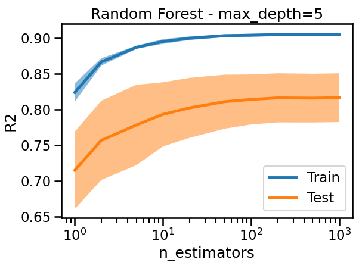

# Guide Module 6 : Méthodes d'Ensemble avec Scikit-learn

## Table des matières
1. [Introduction aux méthodes d'ensemble](#introduction-ensemble)
2. [Random Forest (Forêts Aléatoires)](#random-forest)
3. [Gradient Boosting](#gradient-boosting)
4. [Comparaison des méthodes d'ensemble](#comparaison)
5. [Importance des caractéristiques](#importance-caracteristiques)
6. [Exercices pratiques](#exercices-pratiques)
7. [Bonnes pratiques](#bonnes-pratiques)

---

## 1. Introduction aux méthodes d'ensemble {#introduction-ensemble}

### Qu'est-ce qu'une méthode d'ensemble ?

Les **méthodes d'ensemble** combinent les prédictions de plusieurs modèles de base (appelés **apprenants faibles**) pour créer un modèle final plus robuste et performant.

### Principe fondamental

L'idée centrale est que **plusieurs modèles simples peuvent être plus performants qu'un modèle complexe** lorsqu'ils sont combinés intelligemment.

### Avantages des méthodes d'ensemble

#### **Réduction de la variance**
- Diminue l'impact des prédictions erratiques d'un seul modèle
- Améliore la **stabilité** des prédictions

#### **Réduction du biais**
- Corrige les erreurs systématiques de modèles individuels
- Améliore la **précision** globale

#### **Robustesse**
- Moins sensible aux **outliers** et au **bruit** dans les données
- Généralise mieux sur de nouvelles données

### Types de méthodes d'ensemble

#### **Bagging (Bootstrap Aggregating)**
- Entraîne plusieurs modèles sur des **échantillons différents** des données d'entraînement
- Combine par **moyenne** (régression) ou **vote majoritaire** (classification)
- Exemple : **Random Forest**

#### **Boosting**
- Entraîne les modèles **séquentiellement**
- Chaque modèle corrige les erreurs du précédent
- Exemple : **Gradient Boosting**

---

## 2. Random Forest (Forêts Aléatoires) {#random-forest}

### Principe du Random Forest

Random Forest combine **de nombreux arbres de décision** entraînés sur des échantillons différents des données avec une sélection aléatoire des caractéristiques.

### Mécanisme de fonctionnement

#### **1. Bootstrap Sampling**
- Chaque arbre est entraîné sur un **échantillon bootstrap** des données originales
- Échantillonnage **avec remise** de la même taille que le dataset original

#### **2. Sélection aléatoire des caractéristiques**
- À chaque split, seul un **sous-ensemble aléatoire** des caractéristiques est considéré
- Paramètre `max_features` contrôle le nombre de caractéristiques

#### **3. Agrégation des prédictions**
- **Classification** : vote majoritaire des arbres
- **Régression** : moyenne des prédictions

### API Scikit-learn pour Random Forest

#### **Classification**
```python
from sklearn.ensemble import RandomForestClassifier

# Créer le modèle
rf_clf = RandomForestClassifier(
    n_estimators=100,    # Nombre d'arbres
    max_depth=None,      # Profondeur maximale
    max_features='sqrt', # Nb de caractéristiques par split
    random_state=0
)

# Entraîner le modèle
rf_clf.fit(X_train, y_train)

# Prédictions
predictions = rf_clf.predict(X_test)
probabilities = rf_clf.predict_proba(X_test)
```

#### **Régression**
```python
from sklearn.ensemble import RandomForestRegressor

# Créer le modèle
rf_reg = RandomForestRegressor(
    n_estimators=100,
    max_depth=None,
    max_features='sqrt',
    random_state=0
)

# Entraîner et prédire
rf_reg.fit(X_train, y_train)
predictions = rf_reg.predict(X_test)
```

### Hyperparamètres importants

#### **`n_estimators`**
- **Nombre d'arbres** dans la forêt
- Plus d'arbres = meilleure performance mais plus lent
- Valeurs typiques : 50-500

#### **`max_features`**
- Nombre de caractéristiques considérées à chaque split
- `'sqrt'` : √(nombre_total_features)
- `'log2'` : log₂(nombre_total_features)
- `None` : toutes les caractéristiques

#### **`max_depth`**
- Profondeur maximale des arbres
- `None` : expansion complète
- Contrôle le **surapprentissage**




### Avantages du Random Forest

- **Très robuste** au surapprentissage
- **Gère bien** les données manquantes et les outliers
- **Fournit une estimation** de l'importance des caractéristiques
- **Parallélisable** (entraînement rapide)

---

## 3. Gradient Boosting {#gradient-boosting}

### Principe du Gradient Boosting

Le **Gradient Boosting** construit le modèle d'ensemble **séquentiellement**, où chaque nouveau modèle corrige les erreurs du modèle précédent.

### Mécanisme de fonctionnement

#### **1. Initialisation**
- Commence avec une prédiction simple (moyenne pour régression, classe majoritaire pour classification)

#### **2. Construction séquentielle**
- À chaque étape, entraîne un nouveau modèle sur les **résidus** (erreurs) du modèle actuel
- Le nouveau modèle apprend à corriger les erreurs précédentes

#### **3. Combinaison pondérée**
- Chaque modèle contribue avec un **poids** (learning rate) à la prédiction finale
- Prédiction finale = somme pondérée de tous les modèles

### API Scikit-learn pour Gradient Boosting

#### **Classification**
```python
from sklearn.ensemble import GradientBoostingClassifier

# Créer le modèle
gb_clf = GradientBoostingClassifier(
    n_estimators=100,     # Nombre d'estimateurs
    learning_rate=0.1,    # Taux d'apprentissage
    max_depth=3,          # Profondeur des arbres
    random_state=0
)

# Entraîner le modèle
gb_clf.fit(X_train, y_train)

# Prédictions
predictions = gb_clf.predict(X_test)
```

#### **Régression**
```python
from sklearn.ensemble import GradientBoostingRegressor

# Créer le modèle
gb_reg = GradientBoostingRegressor(
    n_estimators=100,
    learning_rate=0.1,
    max_depth=3,
    random_state=0
)

# Entraîner et prédire
gb_reg.fit(X_train, y_train)
predictions = gb_reg.predict(X_test)
```

### Hyperparamètres importants

#### **`n_estimators`**
- **Nombre de stages de boosting**
- Plus d'estimateurs = modèle plus complexe
- Attention au **surapprentissage** avec des valeurs trop élevées

#### **`learning_rate`**
- **Taux d'apprentissage** qui pondère la contribution de chaque arbre
- Valeurs faibles (0.01-0.1) avec plus d'estimateurs = meilleure performance
- Compromis **vitesse vs performance**

#### **`max_depth`**
- Profondeur des arbres individuels
- Valeurs faibles (1-5) généralement suffisantes
- Contrôle la **complexité** du modèle


### Avantages du Gradient Boosting

- **Excellente performance prédictive**
- **Flexible** (différentes fonctions de perte)
- **Gère naturellement** les interactions entre variables
- **Robuste** aux outliers

### Inconvénients

- **Sensible au surapprentissage** si mal paramétré
- **Entraînement séquentiel** (pas parallélisable)
- **Plus lent** que Random Forest

---

## 4. Comparaison des méthodes d'ensemble {#comparaison}

### Random Forest vs Gradient Boosting

| Aspect | Random Forest | Gradient Boosting |
|--------|---------------|-------------------|
| **Construction** | Parallèle | Séquentielle |
| **Vitesse d'entraînement** | Rapide | Plus lente |
| **Surapprentissage** | Très résistant | Plus sensible |
| **Performance** | Bonne | Excellente |
| **Hyperparamètres** | Moins sensibles | Très sensibles |
| **Interprétabilité** | Moyenne | Moyenne |

### Quand utiliser chaque méthode ?

#### **Random Forest**
- **Données bruitées** avec beaucoup d'outliers
- **Besoin de rapidité** d'entraînement
- **Premier essai** sur un nouveau dataset
- **Peu de temps** pour le tuning d'hyperparamètres

#### **Gradient Boosting**
- **Performance maximale** recherchée
- **Données de qualité** (peu de bruit)
- **Temps disponible** pour l'optimisation
- **Compétitions** de machine learning

---

## 5. Importance des caractéristiques {#importance-caracteristiques}

### Principe de l'importance

Les méthodes d'ensemble permettent de calculer l'**importance relative** de chaque caractéristique dans les prédictions du modèle.

### Calcul de l'importance

#### **Dans les arbres individuels**
- L'importance d'une caractéristique = réduction totale de l'impureté qu'elle apporte
- Somme pondérée sur tous les splits utilisant cette caractéristique

#### **Dans l'ensemble**
- **Random Forest** : moyenne de l'importance sur tous les arbres
- **Gradient Boosting** : somme pondérée selon le gain de chaque arbre

### Accès à l'importance des caractéristiques

```python
# Entraîner le modèle
rf_clf.fit(X_train, y_train)

# Obtenir l'importance des caractéristiques
importances = rf_clf.feature_importances_

# Créer un DataFrame pour la visualisation
import pandas as pd
feature_importance = pd.DataFrame({
    'feature': X_train.columns,
    'importance': importances
}).sort_values('importance', ascending=False)

print(feature_importance)
```

### Visualisation de l'importance

```python
import matplotlib.pyplot as plt

# Graphique en barres
plt.figure(figsize=(10, 6))
plt.barh(feature_importance['feature'], feature_importance['importance'])
plt.xlabel('Importance')
plt.title('Importance des caractéristiques')
plt.gca().invert_yaxis()
plt.show()
```


### Interprétation de l'importance

#### **Utilité de l'information**
- Une importance élevée indique que la caractéristique est **utile pour les prédictions**
- Une importance faible suggère que la caractéristique est **redondante ou non informative**

#### **Sélection de caractéristiques**
- Peut aider à identifier les caractéristiques les plus pertinentes
- Permet de **réduire la dimensionnalité** du problème

#### **Limites**
- L'importance peut être **biaisée** vers les caractéristiques avec plus de modalités
- Les caractéristiques corrélées peuvent avoir leur importance **diluée**

---

## 6. Exercices pratiques {#exercices-pratiques}

### Exercice 1 : Classification avec Random Forest

```python
from sklearn.datasets import make_classification
from sklearn.ensemble import RandomForestClassifier
from sklearn.model_selection import train_test_split
from sklearn.metrics import classification_report

# Générer des données synthétiques
X, y = make_classification(n_samples=1000, n_features=20, 
                          n_informative=10, random_state=42)

# Division des données
X_train, X_test, y_train, y_test = train_test_split(
    X, y, test_size=0.2, random_state=42)

# Créer et entraîner le modèle
rf = RandomForestClassifier(n_estimators=100, random_state=42)
rf.fit(X_train, y_train)

# Évaluation
predictions = rf.predict(X_test)
print(classification_report(y_test, predictions))
```

### Exercice 2 : Comparaison Random Forest vs Gradient Boosting

```python
from sklearn.ensemble import RandomForestClassifier, GradientBoostingClassifier
from sklearn.metrics import accuracy_score
import time

# Modèles à comparer
models = {
    'Random Forest': RandomForestClassifier(n_estimators=100, random_state=42),
    'Gradient Boosting': GradientBoostingClassifier(n_estimators=100, random_state=42)
}

# Comparaison des performances
results = {}
for name, model in models.items():
    start_time = time.time()
    model.fit(X_train, y_train)
    training_time = time.time() - start_time
    
    predictions = model.predict(X_test)
    accuracy = accuracy_score(y_test, predictions)
    
    results[name] = {
        'accuracy': accuracy,
        'training_time': training_time
    }
    
for name, metrics in results.items():
    print(f"{name}:")
    print(f"  Accuracy: {metrics['accuracy']:.3f}")
    print(f"  Training time: {metrics['training_time']:.2f}s")
```

### Exercice 3 : Analyse de l'importance des caractéristiques

```python
# Utiliser un dataset réel
from sklearn.datasets import load_breast_cancer

# Charger les données
data = load_breast_cancer()
X, y = data.data, data.target
feature_names = data.feature_names

# Division et entraînement
X_train, X_test, y_train, y_test = train_test_split(
    X, y, test_size=0.2, random_state=42)

rf = RandomForestClassifier(n_estimators=100, random_state=42)
rf.fit(X_train, y_train)

# Analyse de l'importance
importances = rf.feature_importances_
feature_importance = pd.DataFrame({
    'feature': feature_names,
    'importance': importances
}).sort_values('importance', ascending=False)

# Afficher les 10 caractéristiques les plus importantes
print("Top 10 caractéristiques les plus importantes:")
print(feature_importance.head(10))
```

---

## 7. Bonnes pratiques {#bonnes-pratiques}

### Choix du nombre d'estimateurs

#### **Random Forest**
- Commencer avec `n_estimators=100`
- Augmenter jusqu'à convergence de la performance
- Généralement **plus d'arbres = mieux** (mais plus lent)

#### **Gradient Boosting**
- Commencer avec `n_estimators=100`
- Utiliser **early stopping** pour éviter le surapprentissage
- Surveiller les courbes de validation

### Réglage des hyperparamètres

#### **Stratégie générale**
1. **Random Forest** : moins sensible, réglage plus simple
2. **Gradient Boosting** : très sensible, nécessite un réglage fin

#### **Ordre de priorité pour le tuning**
1. `n_estimators` et `learning_rate` (Gradient Boosting)
2. `max_depth`
3. `max_features` (Random Forest)
4. Autres paramètres de régularisation

### Validation et évaluation

```python
from sklearn.model_selection import cross_val_score

# Validation croisée
cv_scores = cross_val_score(rf, X_train, y_train, cv=5, 
                           scoring='accuracy')
print(f"CV Accuracy: {cv_scores.mean():.3f} ± {cv_scores.std():.3f}")
```

### Gestion du surapprentissage

#### **Random Forest**
- Généralement **moins problématique**
- Réduire `max_depth` si nécessaire
- Augmenter `min_samples_split` et `min_samples_leaf`

#### **Gradient Boosting**
- **Plus critique** à surveiller
- Réduire `learning_rate` et augmenter `n_estimators`
- Utiliser la **validation** pour early stopping

### Sélection de modèle

```python
# Pipeline complet avec validation
from sklearn.model_selection import GridSearchCV

param_grid = {
    'n_estimators': [50, 100, 200],
    'max_depth': [3, 5, None],
    'max_features': ['sqrt', 'log2']
}

grid_search = GridSearchCV(
    RandomForestClassifier(random_state=42),
    param_grid, cv=5, scoring='accuracy'
)

grid_search.fit(X_train, y_train)
print(f"Meilleurs paramètres: {grid_search.best_params_}")
print(f"Meilleur score: {grid_search.best_score_:.3f}")
```

### Recommandations finales

#### **Pour débuter**
1. Essayer **Random Forest** en premier (robuste et simple)
2. Comparer avec **Gradient Boosting** si plus de performance nécessaire
3. Utiliser l'**importance des caractéristiques** pour comprendre le modèle

#### **Pour optimiser**
1. **Validation croisée** systématique
2. **Grid Search** ou **Random Search** pour les hyperparamètres
3. **Courbes d'apprentissage** pour diagnostiquer le surapprentissage
4. **Ensembles d'ensembles** pour la performance ultime

Les méthodes d'ensemble représentent souvent le **meilleur équilibre** entre performance et simplicité d'utilisation en machine learning pratique.