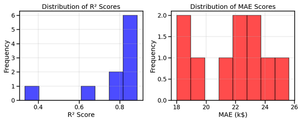
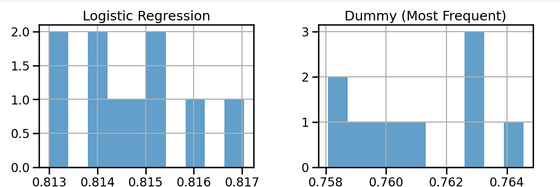
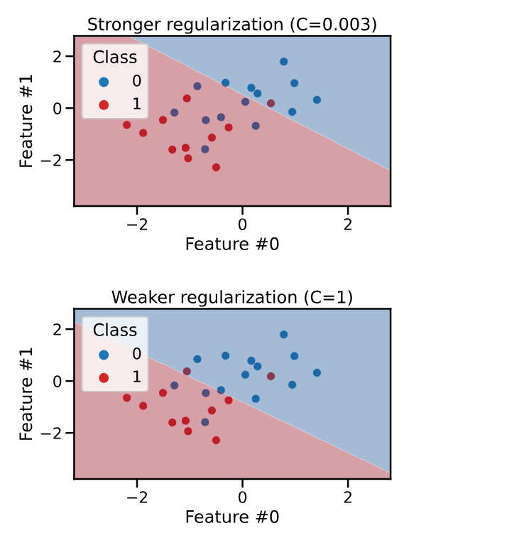
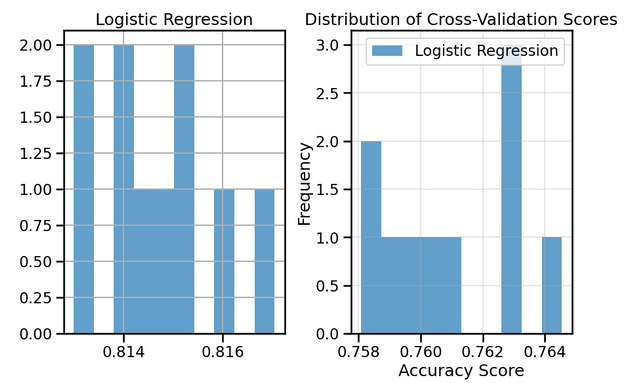

# Guide Module 7 : Stratégies de Validation Croisée et Métriques d'Évaluation

## Table des matières
1. [Introduction à l'évaluation comparative](#introduction-evaluation)
2. [Stratégies de validation croisée adaptées](#strategies-validation)
3. [Stratification des données](#stratification)
4. [Groupement d'échantillons](#groupement-echantillons)
5. [Données non i.i.d et séries temporelles](#donnees-non-iid)
6. [Validation croisée imbriquée](#validation-croisee-imbriquee)
7. [Métriques de classification](#metriques-classification)
8. [Métriques de régression](#metriques-regression)
9. [Exercices pratiques](#exercices-pratiques)
10. [Bonnes pratiques](#bonnes-pratiques)

---

## 1. Introduction à l'évaluation comparative {#introduction-evaluation}

### Importance des modèles de référence

Avant d'évaluer les performances d'un modèle complexe, il est crucial de **comparer avec un modèle de base simple** (baseline). Cette approche permet de :
- Valider que notre modèle apporte une réelle amélioration
- Contextualiser les résultats obtenus
- Détecter des problèmes dans nos données ou notre approche

### Modèles de référence en régression

#### **DummyRegressor**
```python
from sklearn.dummy import DummyRegressor

# Modèle qui prédit toujours la moyenne
dummy_regressor = DummyRegressor(strategy="mean")
dummy_regressor.fit(X_train, y_train)

# Évaluation
baseline_score = dummy_regressor.score(X_test, y_test)
print(f"Score R² du modèle de base : {baseline_score:.3f}")
```

#### **Stratégies disponibles**
- `"mean"` : prédit la moyenne des valeurs cibles
- `"median"` : prédit la médiane des valeurs cibles  
- `"quantile"` : prédit un quantile spécifique
- `"constant"` : prédit toujours une valeur constante

### Modèles de référence en classification

#### **DummyClassifier**
```python
from sklearn.dummy import DummyClassifier

# Différentes stratégies
strategies = {
    "most_frequent": "Prédit toujours la classe majoritaire",
    "stratified": "Respecte la distribution des classes",
    "uniform": "Prédit chaque classe avec probabilité égale"
}

for strategy, description in strategies.items():
    dummy = DummyClassifier(strategy=strategy)
    dummy.fit(X_train, y_train)
    score = dummy.score(X_test, y_test)
    print(f"{strategy}: {score:.3f} - {description}")
```

### Interprétation du score R²

Le score R² d'un `DummyRegressor` avec `strategy="mean"` est **toujours 0.0** par définition mathématique :

$$R^2 = 1 - \frac{\sum_i (y_i - \hat{y}_i)^2}{\sum_i (y_i - \bar{y})^2}$$

Quand $\hat{y}_i = \bar{y}$ pour tous les échantillons :
$$R^2 = 1 - \frac{\sum_i (y_i - \bar{y})^2}{\sum_i (y_i - \bar{y})^2} = 1 - 1 = 0$$



---

## 2. Stratégies de validation croisée adaptées {#strategies-validation}

### Choix de la stratégie selon les données

La stratégie de validation croisée doit être **adaptée à la nature des données** :

| Type de données | Stratégie recommandée | Raison |
|-----------------|----------------------|---------|
| **I.I.D. équilibrées** | KFold | Simple et efficace |
| **Classes déséquilibrées** | StratifiedKFold | Préserve la distribution |
| **Données groupées** | GroupKFold | Évite le data leakage |
| **Séries temporelles** | TimeSeriesSplit | Respecte l'ordre temporel |

### KFold classique

```python
from sklearn.model_selection import KFold, cross_val_score

# KFold standard
kf = KFold(n_splits=5, shuffle=True, random_state=42)
scores = cross_val_score(model, X, y, cv=kf, scoring='accuracy')
print(f"Accuracy: {scores.mean():.3f} ± {scores.std():.3f}")
```

### Problèmes avec KFold non mélangé

Quand les données sont **ordonnées par classe**, KFold sans shuffle peut créer des folds contenant une seule classe :

```python
# Problématique : données ordonnées
kf_no_shuffle = KFold(n_splits=3, shuffle=False)
scores = cross_val_score(model, X, y, cv=kf_no_shuffle)
# Résultat : accuracy = 0.0 (désastre !)

# Solution : activer le mélange
kf_shuffle = KFold(n_splits=3, shuffle=True, random_state=42)
scores = cross_val_score(model, X, y, cv=kf_shuffle)
# Résultat : accuracy > 0.9 (beaucoup mieux)
```

---

## 3. Stratification des données {#stratification}

### Principe de la stratification

La **stratification** garantit que chaque fold contient une proportion représentative de chaque classe, similaire à la distribution globale.

### StratifiedKFold

```python
from sklearn.model_selection import StratifiedKFold

# Stratification pour classification
skf = StratifiedKFold(n_splits=5, shuffle=True, random_state=42)
scores = cross_val_score(model, X, y, cv=skf, scoring='accuracy')

# Vérification de la distribution par fold
for fold, (train_idx, test_idx) in enumerate(skf.split(X, y)):
    train_distribution = y[train_idx].value_counts(normalize=True)
    test_distribution = y[test_idx].value_counts(normalize=True)
    print(f"Fold {fold}:")
    print(f"  Train: {train_distribution.values}")
    print(f"  Test:  {test_distribution.values}")
```

### Comparaison des stratégies


```python
import pandas as pd

strategies = {
    'KFold': KFold(n_splits=3, shuffle=True, random_state=42),
    'StratifiedKFold': StratifiedKFold(n_splits=3, shuffle=True, random_state=42)
}

results = {}
for name, cv in strategies.items():
    scores = cross_val_score(model, X, y, cv=cv, scoring='accuracy')
    results[name] = scores

# Comparaison des résultats
df_results = pd.DataFrame(results)
print(df_results.describe())
```

---

## 4. Groupement d'échantillons {#groupement-echantillons}

### Problématique du data leakage

Certaines données contiennent des **groupes naturels** (patients, écrivains, sessions) qui ne doivent pas être séparés entre train et test.

### Exemple : Reconnaissance d'écriture manuscrite

```python
from sklearn.model_selection import GroupKFold
from sklearn.datasets import load_digits

# Simulation de groupes d'écrivains
digits = load_digits()
X, y = digits.data, digits.target

# Création de groupes artificiels (écrivains)
n_writers = 13
samples_per_writer = len(X) // n_writers
groups = np.repeat(range(n_writers), samples_per_writer)[:len(X)]

# Validation croisée groupée
group_cv = GroupKFold(n_splits=5)
scores = cross_val_score(model, X, y, groups=groups, cv=group_cv)
print(f"GroupKFold accuracy: {scores.mean():.3f} ± {scores.std():.3f}")
```

### Comparaison des stratégies

```python
strategies = {
    'KFold (no shuffle)': cross_val_score(model, X, y, cv=KFold(n_splits=5, shuffle=False)),
    'KFold (shuffle)': cross_val_score(model, X, y, cv=KFold(n_splits=5, shuffle=True)),
    'GroupKFold': cross_val_score(model, X, y, groups=groups, cv=GroupKFold(n_splits=5))
}

for name, scores in strategies.items():
    print(f"{name}: {scores.mean():.3f} ± {scores.std():.3f}")
```

### GroupKFold vs autres méthodes

La validation groupée révèle souvent des **performances plus réalistes** mais plus faibles, car elle teste la capacité du modèle à généraliser à de nouveaux groupes.

---

## 5. Données non i.i.d et séries temporelles {#donnees-non-iid}

### Problème des séries temporelles

Les données temporelles violent l'hypothèse **i.i.d** (indépendantes et identiquement distribuées) car :
- Les observations sont **corrélées temporellement**
- Le futur peut dépendre du passé
- Mélanger les données crée du **data leakage**

### TimeSeriesSplit

```python
from sklearn.model_selection import TimeSeriesSplit

# Validation pour séries temporelles
tss = TimeSeriesSplit(n_splits=5)
scores = cross_val_score(model, X, y, cv=tss, scoring='neg_mean_absolute_error')

# Visualisation des splits
for i, (train_idx, test_idx) in enumerate(tss.split(X)):
    print(f"Split {i}:")
    print(f"  Train: {train_idx[0]:4d} à {train_idx[-1]:4d}")
    print(f"  Test:  {test_idx[0]:4d} à {test_idx[-1]:4d}")
```

### Exemple avec données financières

```python
# Données financières (prix d'actions)
dates = pd.date_range('2020-01-01', periods=1000, freq='D')
prices = np.cumsum(np.random.randn(1000)) + 100

# Mauvaise approche : ShuffleSplit
shuffle_cv = ShuffleSplit(n_splits=5, test_size=0.2, random_state=42)
shuffle_scores = cross_val_score(model, X, y, cv=shuffle_cv)

# Bonne approche : TimeSeriesSplit  
time_cv = TimeSeriesSplit(n_splits=5)
time_scores = cross_val_score(model, X, y, cv=time_cv)

print(f"ShuffleSplit (optimiste): {shuffle_scores.mean():.3f}")
print(f"TimeSeriesSplit (réaliste): {time_scores.mean():.3f}")
```




La différence révèle l'**optimisme excessif** du shuffle split qui permet au modèle d'interpoler entre des points futurs et passés.

---

## 6. Validation croisée imbriquée {#validation-croisee-imbriquee}

### Problématique

Utiliser la **même validation croisée** pour optimiser les hyperparamètres ET évaluer le modèle crée un **biais optimiste** dans l'estimation des performances.

### Principe de la validation imbriquée

```python
from sklearn.model_selection import GridSearchCV

# Configuration imbriquée
inner_cv = KFold(n_splits=5, shuffle=True, random_state=0)  # Optimisation
outer_cv = KFold(n_splits=3, shuffle=True, random_state=0)  # Évaluation

# Modèle avec recherche d'hyperparamètres
param_grid = {'C': [0.1, 1, 10], 'gamma': [0.01, 0.1, 1]}
grid_search = GridSearchCV(
    SVC(), param_grid=param_grid, 
    cv=inner_cv, scoring='accuracy'
)

# Évaluation externe du processus complet
nested_scores = cross_val_score(
    grid_search, X, y, cv=outer_cv, scoring='accuracy'
)

print(f"Score de validation imbriquée: {nested_scores.mean():.3f} ± {nested_scores.std():.3f}")
```

### Comparaison non-imbriquée vs imbriquée


```python
# Approche non-imbriquée (BIAIS)
grid_search.fit(X, y)
biased_score = grid_search.best_score_
print(f"Score non-imbriqué (biaisé): {biased_score:.3f}")

# Approche imbriquée (CORRECT)
nested_score = cross_val_score(grid_search, X, y, cv=outer_cv).mean()
print(f"Score imbriqué (non-biaisé): {nested_score:.3f}")

# Différence révélatrice du biais
bias = biased_score - nested_score
print(f"Biais optimiste: +{bias:.3f}")
```

---

## 7. Métriques de classification {#metriques-classification}

### Matrice de confusion

```python
from sklearn.metrics import ConfusionMatrixDisplay, confusion_matrix

# Matrice de confusion
cm = confusion_matrix(y_true, y_pred)
ConfusionMatrixDisplay.from_predictions(y_true, y_pred)

# Éléments de la matrice
# TP (True Positives)  | FN (False Negatives)
# FP (False Positives) | TN (True Negatives)
```

### Métriques dérivées

#### **Precision, Recall, F1-Score**
```python
from sklearn.metrics import precision_score, recall_score, f1_score

# Calcul des métriques
precision = precision_score(y_true, y_pred, pos_label="positive")
recall = recall_score(y_true, y_pred, pos_label="positive")
f1 = f1_score(y_true, y_pred, pos_label="positive")

print(f"Précision: {precision:.3f}")
print(f"Rappel: {recall:.3f}")
print(f"F1-Score: {f1:.3f}")
```

#### **Définitions mathématiques**
- **Précision** : $\frac{TP}{TP + FP}$ - Proportion de prédictions positives correctes
- **Rappel** : $\frac{TP}{TP + FN}$ - Proportion de vrais positifs détectés
- **F1-Score** : $\frac{2 \times \text{Precision} \times \text{Recall}}{\text{Precision} + \text{Recall}}$ - Moyenne harmonique

### Problème du déséquilibre des classes

```python
# Vérification de la distribution
class_distribution = pd.Series(y).value_counts(normalize=True)
print("Distribution des classes:")
print(class_distribution)

# Accuracy vs Balanced Accuracy
from sklearn.metrics import accuracy_score, balanced_accuracy_score

accuracy = accuracy_score(y_true, y_pred)
balanced_acc = balanced_accuracy_score(y_true, y_pred)

print(f"Accuracy: {accuracy:.3f}")
print(f"Balanced Accuracy: {balanced_acc:.3f}")
```

### Courbes ROC et Precision-Recall

```python
from sklearn.metrics import RocCurveDisplay, PrecisionRecallDisplay

# Courbe ROC
RocCurveDisplay.from_estimator(model, X_test, y_test)

# Courbe Precision-Recall  
PrecisionRecallDisplay.from_estimator(model, X_test, y_test)
```

### Métriques avec validation croisée

```python
from sklearn.metrics import make_scorer

# Scorer personnalisé pour une classe spécifique
precision_scorer = make_scorer(precision_score, pos_label="donated")

# Évaluation en validation croisée
cv_precision = cross_val_score(model, X, y, cv=5, scoring=precision_scorer)
print(f"Précision CV: {cv_precision.mean():.3f} ± {cv_precision.std():.3f}")

# Métriques multiples
from sklearn.model_selection import cross_validate

metrics = ['accuracy', 'precision_macro', 'recall_macro', 'f1_macro']
cv_results = cross_validate(model, X, y, cv=5, scoring=metrics)

for metric in metrics:
    scores = cv_results[f'test_{metric}']
    print(f"{metric}: {scores.mean():.3f} ± {scores.std():.3f}")
```

---

## 8. Métriques de régression {#metriques-regression}

### Métriques principales

#### **Mean Squared Error (MSE)**
```python
from sklearn.metrics import mean_squared_error

mse = mean_squared_error(y_true, y_pred)
print(f"MSE: {mse:.3f}")
```

#### **R² Score (Coefficient de détermination)**
```python
from sklearn.metrics import r2_score

r2 = r2_score(y_true, y_pred)
print(f"R²: {r2:.3f}")

# R² = 1 - SS_res/SS_tot
# où SS_res = Σ(y_true - y_pred)²
#     SS_tot = Σ(y_true - y_mean)²
```

#### **Mean Absolute Error (MAE)**
```python
from sklearn.metrics import mean_absolute_error

mae = mean_absolute_error(y_true, y_pred)
print(f"MAE: {mae:.3f} unités")
```

#### **Mean Absolute Percentage Error (MAPE)**
```python
from sklearn.metrics import mean_absolute_percentage_error

mape = mean_absolute_percentage_error(y_true, y_pred)
print(f"MAPE: {mape * 100:.2f}%")
```

### Métriques interprétables vs normalisées

| Métrique | Type | Avantage | Inconvénient |
|----------|------|----------|--------------|
| **R²** | Normalisée | Comparable entre datasets | Pas d'unité physique |
| **MAE** | Interprétable | Même unité que la cible | Non comparable |
| **MAPE** | Relative | Pourcentage intuitive | Problème avec valeurs nulles |

### Visualisation des résidus

```python
from sklearn.metrics import PredictionErrorDisplay

fig, axes = plt.subplots(1, 2, figsize=(12, 5))

# Prédictions vs Valeurs vraies
PredictionErrorDisplay.from_predictions(
    y_true, y_pred, kind="actual_vs_predicted", ax=axes[0]
)

# Résidus vs Prédictions
PredictionErrorDisplay.from_predictions(
    y_true, y_pred, kind="residual_vs_predicted", ax=axes[1]  
)
```






---

## 9. Exercices pratiques {#exercices-pratiques}

### Exercice 1 : Comparaison de baselines

```python
# Dataset sanguin
blood_transfusion = pd.read_csv("blood_transfusion.csv")
X = blood_transfusion.drop(columns="Class")
y = blood_transfusion["Class"]

# Modèles baseline
baselines = {
    'most_frequent': DummyClassifier(strategy='most_frequent'),
    'stratified': DummyClassifier(strategy='stratified'), 
    'uniform': DummyClassifier(strategy='uniform')
}

# Modèle réel
from sklearn.linear_model import LogisticRegression
real_model = LogisticRegression()

# Comparaison
results = {}
cv = StratifiedKFold(n_splits=10, shuffle=True, random_state=42)

for name, model in {**baselines, 'logistic': real_model}.items():
    scores = cross_val_score(model, X, y, cv=cv, scoring='accuracy')
    results[name] = scores

# Analyse
df_results = pd.DataFrame(results)
print(df_results.describe())
```

### Exercice 2 : Métriques de régression

```python
# Dataset immobilier
housing = pd.read_csv("house_prices.csv")
X = housing.select_dtypes(include=[np.number]).drop(columns="SalePrice")
y = housing["SalePrice"] / 1000  # En milliers

# Modèle
from sklearn.linear_model import LinearRegression
model = LinearRegression()

# Métriques multiples
metrics = ['r2', 'neg_mean_absolute_error', 'neg_mean_squared_error']
cv_results = cross_validate(model, X, y, cv=10, scoring=metrics)

print("Résultats de validation croisée:")
for metric in metrics:
    scores = cv_results[f'test_{metric}']
    if 'neg_' in metric:
        scores = -scores  # Conversion en valeurs positives
        metric = metric.replace('neg_', '')
    print(f"{metric}: {scores.mean():.3f} ± {scores.std():.3f}")
```

### Exercice 3 : Validation groupée

```python
# Simulation de données groupées
n_groups = 5
n_samples_per_group = 100
groups = np.repeat(range(n_groups), n_samples_per_group)

# Comparaison des stratégies
strategies = {
    'KFold': KFold(n_splits=5, shuffle=True, random_state=42),
    'GroupKFold': GroupKFold(n_splits=5)
}

for name, cv_strategy in strategies.items():
    if 'Group' in name:
        scores = cross_val_score(model, X, y, groups=groups, cv=cv_strategy)
    else:
        scores = cross_val_score(model, X, y, cv=cv_strategy)
    
    print(f"{name}: {scores.mean():.3f} ± {scores.std():.3f}")
```

---

## 10. Bonnes pratiques {#bonnes-pratiques}

### Choix de la stratégie de validation

#### **Questions à se poser**
1. **Les données sont-elles i.i.d ?** → KFold vs TimeSeriesSplit
2. **Y a-t-il un déséquilibre des classes ?** → StratifiedKFold
3. **Existe-t-il des groupes naturels ?** → GroupKFold
4. **Les données ont-elles une structure temporelle ?** → TimeSeriesSplit

#### **Arbre de décision**
```
Données temporelles ? 
├─ OUI → TimeSeriesSplit
└─ NON → Groupes naturels ?
    ├─ OUI → GroupKFold/LeaveOneGroupOut
    └─ NON → Classes déséquilibrées ?
        ├─ OUI → StratifiedKFold
        └─ NON → KFold
```

### Éviter les pièges courants

#### **1. Data leakage temporel**
```python
# MAUVAIS
cv_bad = KFold(shuffle=True)  # Mélange les données temporelles

# BON  
cv_good = TimeSeriesSplit(n_splits=5)  # Respecte l'ordre
```

#### **2. Biais d'optimisation**
```python
# MAUVAIS
grid = GridSearchCV(model, params, cv=5)
grid.fit(X, y)
score = grid.best_score_  # Biaisé !

# BON
nested_score = cross_val_score(grid, X, y, cv=5)  # Non biaisé
```

#### **3. Métriques inappropriées**
```python
# Vérifier le déséquilibre
class_counts = pd.Series(y).value_counts()
imbalance_ratio = class_counts.min() / class_counts.max()

if imbalance_ratio < 0.1:  # Très déséquilibré
    metric = 'balanced_accuracy'
else:
    metric = 'accuracy'
```

### Validation de la stratégie

#### **Diagnostics visuels**
```python
def plot_cv_strategy(cv, X, y, groups=None):
    """Visualise les splits de la validation croisée"""
    fig, ax = plt.subplots(figsize=(12, 6))
    
    splits = cv.split(X, y, groups) if groups is not None else cv.split(X, y)
    
    for i, (train_idx, test_idx) in enumerate(splits):
        ax.scatter(train_idx, [i] * len(train_idx), 
                  c='blue', marker='s', s=10, alpha=0.6)
        ax.scatter(test_idx, [i] * len(test_idx), 
                  c='red', marker='o', s=10)
    
    ax.set_xlabel('Index des échantillons')
    ax.set_ylabel('Fold')
    ax.legend(['Train', 'Test'])
    plt.show()

# Utilisation
plot_cv_strategy(TimeSeriesSplit(n_splits=5), X, y)
```

### Recommandations finales

#### **Pour la validation croisée**
1. **Toujours** comparer avec un modèle baseline
2. **Adapter** la stratégie à la nature des données
3. **Utiliser** la validation imbriquée pour l'optimisation d'hyperparamètres
4. **Vérifier** la cohérence des résultats entre folds

#### **Pour les métriques**
1. **Choisir** des métriques adaptées au problème métier
2. **Combiner** métriques interprétables et normalisées
3. **Analyser** la distribution des erreurs, pas seulement la moyenne
4. **Visualiser** les résultats pour détecter les biais

La validation croisée et le choix des métriques sont **cruciaux** pour une évaluation fiable des modèles de machine learning. Une mauvaise stratégie peut conduire à des conclusions erronées et des déploiements défaillants.